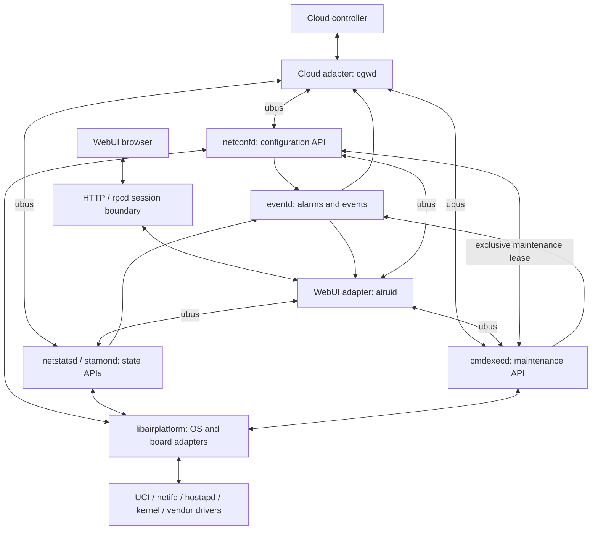

# aircnms redesign: management adapters, domain services, and platform adapters

Status: Draft for review. Date: 2026-09-07. Scope: design only.

Detailed priorities and component specifications are in [Architecture Overview](ARCHITECTURE_OVERVIEW.md). The [identity](IDENTITY_IMPLEMENTATION_SPEC.md) and [journal](JOURNAL_IMPLEMENTATION_SPEC.md) implementation specifications refine the decisions below and take precedence for identity, confirmation, durability, expiry, and recovery. Their target qualification gates remain open.

## 1. Recommendation

Adopt **management adapters (cloud, WebUI) → domain services (existing daemons) → platform adapters (OS and hardware)**. Responses and events flow back to the callers.

The existing domain services own policy, validation, configuration changes, and operation lifecycle. Cloud and WebUI call the same service APIs directly over ubus. No separate middleware daemon, API gateway, or central request router is proposed.

Keep existing daemon and binary names initially. Refactor responsibilities inside them before moving directories or splitting processes. Platform starts as a library used by domain services; add a privileged helper only where verified privilege or blocking-driver requirements justify it.

Success means the same authorized request produces the same validation, conflict handling, and outcome from cloud and WebUI, while adding a board requires changes primarily in platform adapters.

## 2. Current baseline and relationship to existing documents

This proposal builds on [Full Modular Redesign Analysis](FULL_MODULAR_REDESIGN_ANALYSIS.md) and [AirUI Manager Implementation](AIRUI_MANAGER_IMPLEMENTATION.md). This document is the revised target following the decision to use existing domain services directly, and takes precedence over earlier middleware/gateway or additional-daemon proposals. It refines the shared API, ownership, and recovery decisions; it does not claim that proposed APIs already exist. Existing files contain ongoing changes, so observations describe the inspected working tree rather than a released firmware.

| Observed boundary | Evidence | Design implication |
| --- | --- | --- |
| AirUI performs UCI mutations, commits, and network reloads | `src/managers/airuid/src/airui_network.c` | Route these through the configuration owner |
| Configuration includes board-specific source and headers | `src/managers/netconfd/Makefile`, `src/managers/netconfd/src/target_mtk.c`, `src/managers/netconfd/src/target_jedi.c` | Extract a platform contract |
| Cloud receives opaque `data`/`size` messages and decodes native binary fields | `src/managers/cgwd/src/cgw_ubus.c` | Version serialized contracts and isolate legacy translation |
| Command execution contains shell operations, including UCI commit | `src/managers/cmdexecd/src/cmdexec_target.c` | Inventory all writers, including maintenance paths |
| Multiple daemons and platform directories already exist | `Makefile`, `src/platform/`, `files/airnetconfd` | Evolve existing services and supervision |

These are architectural findings, not a complete security or runtime audit. Board support and resource headroom still require target testing.

## 3. Target structure



Each domain service exposes its own typed ubus objects. A shared client library provides encoding, error handling, and connection helpers; it owns no configuration, policy, persistent state, or routing process. Managers compose views by calling the relevant owners. Packet forwarding remains in the kernel and existing networking services.

Source dependencies point downward: management adapters depend on public service contracts; domain services depend on platform contracts; platform code does not depend on cloud/UI schemas. Service-to-service coordination is explicit and bounded. A configuration apply does not depend on cloud, AirUI, telemetry, or event delivery being available.

| Layer | Owns | Must delegate |
| --- | --- | --- |
| Cloud manager (`cgwd`) | Enrollment, authenticated cloud transport, protocol translation, reconnect and outbound delivery | Configuration policy, UCI writes, driver operations |
| WebUI manager (`airuid`) | UI response shaping, authenticated session integration, presentation aggregation | Configuration policy, UCI writes, driver operations |
| Domain services | Product model, authorization, validation, conflict resolution, jobs, configuration coordination, state and event contracts | Board details and OS execution |
| Platform | Typed OS/driver operations, capability probing, normalized errors and observations | Product policy, user roles, MQTT topics, UI fields |

A future CLI calls the same domain service APIs. Managers may cache display data with explicit freshness, but cannot create an independent authoritative configuration store.

## 4. Service ownership

| Existing service | Proposed responsibility |
| --- | --- |
| `netconfd` | Sole coordinator for managed persistent network, wireless, firewall, portal, and policy changes; desired configuration revision and rollback journal |
| `netstatsd` | Periodic sampled metrics, timestamps, freshness, bounded aggregation |
| `stamond` | Station identity, lifecycle, current station state and bounded history |
| `cmdexecd` | Typed maintenance jobs: diagnostics, reboot, reset, upgrade; coordinate exclusive access with configuration |
| `eventd` | Alarm normalization, deduplication, bounded event delivery; not a dependency for successful configuration |
| `acld` | Application visibility/policy evaluation; submit configuration intent to the owner instead of writing shared configuration |
| Portal modules | Remain inside configuration initially; extract only when measured isolation needs justify it |

For every UCI package and generated file, migration must name exactly one owner. Portal, rate-limit, and ACL modules produce a plan executed under that owner's transaction. Read-only polling must not trigger hidden persistent writes.

Use one global configuration mutation slot initially because network, wireless, firewall, and portal operations interact. Readers continue serving the last consistent snapshot with a pending-operation indicator. Firmware upgrade/reset obtains the same exclusive maintenance lease; reboot cannot interrupt an apply without an explicit recovery policy.

`netconfd` owns this slot and exposes a restricted internal lease API to `cmdexecd`. Persist admission of disruptive maintenance before returning the lease. After either daemon restarts, reconcile the recorded maintenance operation before reopening configuration writes; lease timeout alone must not allow writes during an upgrade. Fail closed for new disruptive operations if the coordinator is unavailable. Routine diagnostics that cannot mutate configuration need no exclusive lease. Lease tokens and methods are available only to the authorized maintenance service.

### Example: change an existing SSID

1. `cgwd` translates a cloud command, or `airuid` translates a WebUI request, into `air.config.v1.apply` with the same resource model.
2. `netconfd` authorizes the caller, validates the SSID and dependencies, checks the revision, and creates the recoverable operation.
3. `netconfd` calls `libairplatform` to apply the configuration and observe the result.
4. `netconfd` confirms or rolls back the change and exposes its operation outcome directly to either adapter.
5. `eventd` distributes the resulting event when available. Event delivery failure does not change the configuration outcome.

The browser and cloud controller never choose vendor commands. The platform adapter never decides which controller is allowed to change the SSID.

## 5. Domain service API contracts

Retain ubus for local control IPC. Each proposed object has exactly one hosting daemon. Keep existing `airui.*` and cloud formats as compatibility adapters during migration. A common contract does not require a common hosting process.

| Proposed object | Owner | Initial methods |
| --- | --- | --- |
| `air.config.v1` | `netconfd` | `get`, `validate`, `apply`, `confirm`, `operation_get`, `operation_cancel` |
| `air.telemetry.v1` | `netstatsd` | `device`, `radios`, `interfaces` |
| `air.stations.v1` | `stamond` | `list`, `get`, `history` |
| `air.maintenance.v1` | `cmdexecd` | `operation_get`, `operation_cancel`, explicitly named maintenance operations |
| `air.events.v1` | `eventd` | `list`, `get`, event delivery metadata |

Each object also exposes `health` and `capabilities` for its own domain. AirUI and cloud adapters may aggregate those replies while preserving source and freshness. Operation responses include their owning object, so polling goes directly to that service. Shared lifecycle semantics and codecs do not transfer job ownership to `cmdexecd` or require a global jobs daemon.

Contracts specify required fields, types, units, maximum lengths/counts, enums, privilege, deadline, and retry behavior. Reject unknown mutation fields to catch mistakes; additive response fields are tolerated. Breaking semantics require a new major object version. Native C structs, pointers, padding, and native-endian enums are not wire formats. Keep existing binary compatibility in adapters until consumers migrate; use an explicitly versioned encoding for any retained bulk binary channel.

Illustrative `air.config.v1.apply` arguments:

```json
{
  "request_id": "req-891",
  "idempotency_key": "ssid-change-42",
  "expected_revision": "41",
  "deadline_ms": 5000,
  "changes": [{"resource": "wireless.ssid", "id": "guest", "set": {"enabled": true}}],
  "confirmation": {"required": true, "timeout_s": 120}
}
```

Illustrative accepted reply:

```json
{
  "api_version": 1,
  "request_id": "req-891",
  "status": "accepted",
  "operation_id": "op-102",
  "operation_owner": "air.config.v1",
  "current_revision": "41"
}
```

Acceptance means the job has been admitted and its durable recovery record exists; it does not mean the configuration is active. Query `air.config.v1.operation_get` for this configuration operation; maintenance jobs are queried at `air.maintenance.v1.operation_get`. All deadlines are capped by the server; admission deadlines and execution deadlines are separate. Transport timeout does not cancel an accepted operation.

Use stable errors: `invalid_argument`, `unauthorized`, `forbidden`, `unsupported`, `conflict`, `busy`, `unavailable`, `timeout`, `apply_failed`, `rollback_failed`, and `internal`. Error data includes the field/resource, safe explanation, retryability, and operation ID when applicable. Distinguish transport failure from a domain error. Never represent unavailable measurements as zero or unsupported operations as success.

Scope idempotency keys to authenticated principal and operation type, and bind each key to a canonical payload hash. Same key and payload returns the existing result; changed payload returns conflict. Persist keys for accepted mutations across restart, with documented bounded retention. After retention expires, callers must reconcile revision/state before retrying. Do not promise exactly-once execution of irreversible actions across power loss.

Paginate station/history responses. Responses include sample time, monotonic age, freshness, and partial failures. Events include schema version, producer boot ID, sequence number, resource, revision, and operation ID. Consumers detecting sequence gaps fetch a snapshot; ubus events are not a durable log.

## 6. Configuration consistency and recovery

UCI remains the persisted system configuration representation. `netconfd` owns a normalized product view, revision metadata, candidate changes, and a bounded recovery journal; avoid a second independently writable configuration database. Desired state and observed runtime state are separate and exposed together when useful.

Recommended transaction lifecycle:

1. Authenticate and authorize, check capability and all fields, acquire the mutation slot, and compare `expected_revision` under that lock.
2. Build an isolated candidate from the committed revision. Validate cross-resource constraints and generate an ordered apply plan. Dry-run returns that plan without changing persistent or runtime state.
3. Durably record the previous configuration, candidate, operation identity, and recovery state before the first side effect. Reject admission if storage or recovery capacity is insufficient.
4. Apply through platform adapters with bounded steps. Record progress before/after steps as needed to recover an ambiguous crash. Multi-package UCI and driver operations are not assumed atomic.
5. Verify runtime state and management reachability appropriate to the operation. An accepted reload or a running process alone is insufficient.
6. For disruptive changes, enter `awaiting_confirmation`. Require confirmation from the authorized initiating controller/session or an explicitly permitted recovery administrator after reconnection. Return a scoped confirmation token securely, never in logs. Keep the mutation slot until confirmation or rollback. The service determines whether confirmation is mandatory; a caller cannot disable required protection. Non-disruptive changes may finalize after successful verification.
7. On confirmation, durably finalize the new committed revision and result, then publish completion. On failure/expiry, restore the prior configuration and reapply/verify it. Rollback failure enters degraded recovery mode and blocks further normal writes.

Public states: `queued`, `applying`, `verifying`, `awaiting_confirmation`, `succeeded`, `rolling_back`, `rolled_back`, `failed`, `recovery_required`. Cancellation is supported before execution or at explicitly safe checkpoints; it is not a generic undo operation.

Power-loss behavior must be deterministic: at startup, recover an unfinished transaction before declaring write readiness. Restore the last confirmed configuration for an unconfirmed apply, including when the monotonic confirmation timer was lost across reboot. A crash after final commit but before reply must recover as succeeded. Journal writes require integrity checks, durable file replacement, and platform-specific filesystem/power-cut validation; a renamed file alone does not prove durability.

OpenWrt already provides UCI apply/confirm/rollback mechanisms. Evaluate the exact SDK implementation for reuse, but do not assume it covers vendor runtime state, cross-service recovery, or reboot persistence. See the [UCI technical reference](https://openwrt.org/docs/techref/uci) and [rpcd UCI implementation](https://git.openwrt.org/project/rpcd/tree/uci.c).

### Cloud versus local control

Default policy: authorized cloud and local requests have equal configuration semantics; revision conflicts prevent silent overwrites. A reconnecting cloud must read the current revision before reconciling. A policy-locked cloud-managed field returns `forbidden` to local edits with a safe reason. Device operating mode and ownership policy are explicit, persisted, and authorized to change; request origin alone is not authority.

Existing LuCI pages, shell scripts, provisioning tools, and maintenance code that write managed configuration must migrate or be disabled for those resources. Detect out-of-band edits and report drift; do not silently overwrite them. Root recovery remains possible but requires an explicit adopt-or-restore reconciliation before normal writes resume.

## 7. Platform abstraction

Introduce `libairplatform` with a small public C contract and shared OpenWrt implementation plus MTK, MTK JEDI, QCA, and fake/test backends. Directory presence does not imply equivalent feature support. Select the implementation at build time initially and probe actual runtime capabilities.

Group operations around capabilities: radio enumeration/configuration, VIF lifecycle, station information, network/firewall application, counters, device identity, and maintenance. Return `unsupported` for unavailable features. Define units (for example dBm, bytes, milliseconds), counter width/wrap behavior, memory ownership, callback lifetime, thread affinity, timeout, cancellation, and partial-result semantics.

The owning domain service supplies a validated desired operation. Platform translates it to UCI, netifd, hostapd, netlink, ioctl, or a vendor command and returns normalized results. Platform does not independently commit product changes outside the owner's transaction. Asynchronous hardware events are normalized and delivered upward.

Prefer native APIs. Where executables are necessary, use fixed executable paths and argument vectors, bounded output, timeout/termination, and checked exit status. Never interpolate remote parameters into shell strings. Blocking operations run in bounded workers; a stuck vendor call must not stall the service event loop indefinitely.

The fake backend must simulate timeout, unsupported capability, partial apply, device disappearance, and rollback failure. A compiled backend must pass the same contract suite before a board is supported.

## 8. Security boundaries

WebUI sessions are authenticated at the HTTP/rpcd boundary; cloud commands are authenticated and scoped to the enrolled device/controller. Management adapters propagate trusted identity to the owning domain service for authorization. A JSON `actor` or `role` supplied by a caller is not trusted identity.

Choose and verify a concrete identity mechanism for the shipped SDK: restrict service accounts and bus permissions, bind requests to authenticated sessions/peers, and enforce method/resource permissions at the owner. A manager forwarding identity must be a trusted, restricted ingress with a documented delegation model. If the SDK cannot establish this boundary, use a narrow authenticated ingress or privileged broker before exposing writes.

rpcd ACLs protect its exposed calls; do not assume they authorize every direct local ubus client. Validate both entry paths. OpenWrt documents the relevant mechanisms in [ubus](https://openwrt.org/docs/techref/ubus) and [rpcd](https://openwrt.org/docs/techref/rpcd).

Use least privilege per daemon, strict method allowlists, TLS peer/hostname validation, bounded parsing/decompression, replay protection for cloud commands, and redacted logs. Store credentials with restrictive ownership and support rotation. Firmware jobs verify signature, target compatibility, and image integrity before installation; rollback guarantees depend on flash/bootloader layout and must be reported as capabilities. Keep recovery access and reset behavior explicitly defined.

## 9. Reliability and operations

| Failure | Required behavior |
| --- | --- |
| Cloud offline | Local configuration and forwarding continue; reconnect uses capped exponential backoff with jitter |
| Queue full | Reject commands explicitly; coalesce/drop telemetry according to documented policy and count losses |
| ubus/service restart | Reconnect, rediscover objects, restore subscriptions, resync snapshots; no blind mutation retries |
| Configuration daemon crash | Recover journal before accepting writes; retain queryable operation outcome |
| Slow driver | Timeout bounded work, report degraded health, keep unrelated reads available |
| Flash full | Reject writes before effects when recovery cannot be secured; expose storage alarm |
| Event loss | Detect gaps and resync state; operation polling remains authoritative |
| Conflicting upgrade/apply | Exclusive lease rejects or queues the second operation within a bounded limit |

Separate control admission from telemetry queues and worker capacity. Cap message bytes, item count, age, retries, disk usage, history retention, and decompressed size. Reserve journal/result capacity for already accepted commands. Persist only selected critical events/results; batch/coalesce telemetry to limit flash wear.

Continue procd supervision with bounded restart behavior. Startup order is a hint; readiness depends on actual bus/backend/recovery availability. Distinguish liveness, readiness, and degraded state. Graceful shutdown stops admissions and leaves accepted work in a recoverable state.

Expose per-service version, backend/capabilities, uptime, dependency state, queue depth/drops, operation latency/failure counts, reconnect counts, configuration revision, drift, rollback outcome, and storage pressure. Correlate logs using request/operation IDs. Bound log retention and never include credentials or entire sensitive payloads in diagnostics.

## 10. Proposed source organization

```text
src/
  managers/                 # cgwd, airuid: transport and presentation
  services/                 # optional later relocation of existing domain daemons
    netconfd/ netstatsd/ stamond/ cmdexecd/ eventd/ acld/
  api/                      # schemas, version rules, fixtures, generated bindings
  libs/
    airapi/                 # typed clients/codecs and shared error definitions
    airplatform/            # public platform headers
    ...                     # retain useful existing utilities
  platform/
    common/ mtk/ mtk_jedi/ qca/ fake/
tests/
  contracts/ integration/ recovery/
```

Move directories only after interfaces stabilize. Initially `netconfd` and other domain services can stay under `src/managers/` while their ownership and public contracts are refactored. Avoid introducing a separate library for every helper or a daemon for every feature. Build dependency checks should prevent manager includes of vendor headers and platform includes of cloud/UI contracts.

Keep the current package initially. Split optional telemetry/history/portal components only when dependency and image-size measurements justify it. Declare versions, runtime dependencies, installed paths, config preservation, service lifecycle, and supported board matrix explicitly. Isolate build outputs from source; use reproducible toolchain inputs and produce release provenance and dependency inventory.

## 11. Incremental migration and release gates

| Phase | Deliverable | Exit evidence |
| --- | --- | --- |
| 0: Baseline | Inventory API consumers and every persistent writer; capture behavior, resource usage, supported firmware/boards | Ownership map and baseline build/boot/cloud/UI checks |
| 1: Contracts | Versioned read API, capabilities, errors, fake backend; legacy adapters | Both managers consume identical state fixtures; unsupported/partial behavior verified |
| 2: First mutation | Move one existing SSID edit through `netconfd`, revision checks, job lifecycle, journal and confirmation | Cloud/UI parity, concurrent edit rejection, duplicate request handling, restart/power-loss recovery |
| 3: Platform | Extract operations needed by that vertical slice; expand backend contract tests | Real-board apply/verify/rollback passes for each claimed backend |
| 4: Full ownership | Migrate remaining network/security/portal writers and maintenance coordination | No bypass for managed resources; out-of-band drift detected |
| 5: Hardening | Privilege boundaries, bounded queues, observability, upgrade/recovery and packaging | Failure injection, ACL negative tests, target soak and install/upgrade gates pass |
| 6: Cleanup | Remove obsolete aliases/dead paths, then reorganize directories | Consumer migration verified and compatibility window documented |

Roll out per resource with exactly one selected write route. Shadow validation/read comparison is useful; dual application is prohibited. Switching a resource back to legacy operation requires draining/recovering pending jobs and confirming schema compatibility. A firmware downgrade must restore compatible configuration or be rejected, not silently discard newer fields.

Tests should cover schema fuzzing and bounds, unauthorized direct bus access, payload replay, two writers at one revision, repeated idempotency keys, stale cloud reconnect, lost acknowledgement, process kill at every journal transition, power cuts, rollback failure, bus restart, driver hangs, full storage, and sustained telemetry pressure during configuration. Host tests cannot substitute for real driver and flash testing.

Before release, record measured RAM/CPU/flash budgets, maximum station count, supported queue limits, read latency, apply/rollback deadlines, reconnect behavior, and soak duration for each target profile. These values are deliberately unresolved until baseline measurements exist; production readiness requires explicit pass/fail thresholds and evidence, not just this design.

## 12. Decisions to settle before implementation

1. First supported board/SDK profiles and their resource budgets.
2. Cloud-managed versus locally managed field policy and recovery administrator permissions.
3. Exact trusted identity propagation and local bus authorization available in those SDKs.
4. Management reachability checks, confirmation timeout, and safe recovery network behavior.
5. Flash layout, durable journal budget, firmware signing trust roots, and supported upgrade/downgrade guarantees.
6. Compatibility window for current cloud messages and `airui.*` consumers.

Recommended first implementation slice: an existing SSID edit from both cloud and WebUI through the `netconfd` API, with revision conflict handling, a queryable job, and tested rollback. This demonstrates the architecture end to end before expanding it across the package.
