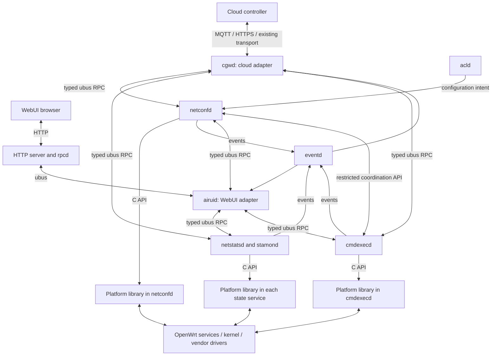
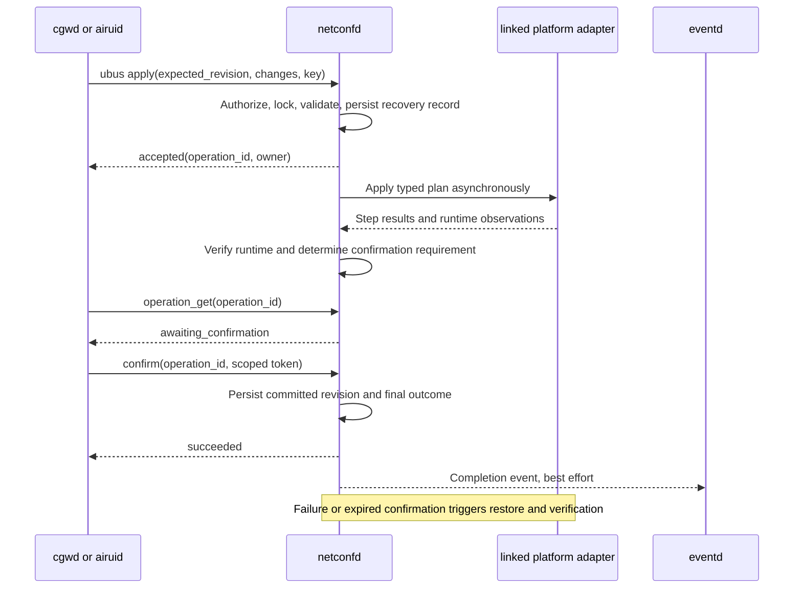

# aircnms architecture: detailed redesign overview

Status: proposed design, not implemented. Date: 2026-09-07.

This document expands the agreed direction in [Architecture Design](ARCHITECTURE_DESIGN.md): **management adapters → domain services → platform adapters**. It is the detailed overview for subsequent implementation specifications. Existing daemon names are retained. All new API names, library interfaces, layouts, and examples below are proposals.

## 1. Purpose and architectural decisions

The package should expose consistent device behavior to cloud and WebUI, isolate board-specific implementation, and recover safely when communication, a service, or power fails.

The design uses existing processes with clearer responsibilities:

1. `cgwd` and `airuid` translate external requests and present results.
2. Domain services validate requests, enforce permissions and policy, own state, and coordinate operations.
3. Platform adapters implement OS and hardware operations through a typed C interface.
4. Managers call services directly using ubus. Services call their linked platform library using C functions.
5. procd supervises daemon processes. Managers do not act as service supervisors.
6. There is no new middleware daemon, central API router, or general-purpose platform daemon.

The existing directory name `src/managers/` does not define the target responsibility of every daemon inside it. For example, `netconfd` is a domain service even while it remains in that directory.

### Goals

| Goal | Expected outcome |
| --- | --- |
| Consistent management | Equivalent cloud and UI requests use identical domain validation and execution |
| Clear ownership | Every managed persistent resource has one write coordinator |
| Board portability | Board-specific headers, commands, and branches are contained in platform adapters |
| Safe changes | Revision checks, durable operation records, verification, and rollback protect configuration |
| Bounded behavior | Work queues, requests, retries, history, and storage have explicit limits |
| Operational visibility | Health, capability, freshness, operation outcome, and failure details are queryable |
| Incremental delivery | Existing behavior is migrated one resource at a time with compatibility adapters |

### Scope boundaries

This is a device control-plane design. Packet forwarding remains in the kernel and existing networking components. It does not redesign the cloud product or browser frontend, mandate a new language, replace OpenWrt networking services, or promise that every board supports every feature. Hardware support is demonstrated through capability reporting and target tests.

## 2. Current package and motivation

The inspected working tree already contains `cgwd`, `airuid`, `netconfd`, `netstatsd`, `stamond`, `cmdexecd`, `eventd`, and `acld`, together with shared libraries and platform directories. These are useful starting boundaries.

| Current observation | Source reference | Target change |
| --- | --- | --- |
| AirUI writes UCI and requests network reload directly | [airui_network.c](src/managers/airuid/src/airui_network.c) | Move managed mutations behind `netconfd` |
| Configuration build includes vendor/platform implementation | [netconfd Makefile](src/managers/netconfd/Makefile) | Link a public platform API |
| Cloud ubus handlers receive opaque `data`/`size` payloads | [cgw_ubus.c](src/managers/cgwd/src/cgw_ubus.c) | Introduce versioned contracts and isolate legacy decoding |
| Maintenance implementation includes shell-based configuration operations | [cmdexec_target.c](src/managers/cmdexecd/src/cmdexec_target.c) | Coordinate writes and encapsulate low-level execution |
| Package builds and installs multiple daemons | [Makefile](Makefile) | Keep processes initially; improve contracts and lifecycle |

These are source observations, not verified runtime guarantees. The tree contains ongoing work. Earlier background is available in [Full Modular Redesign Analysis](FULL_MODULAR_REDESIGN_ANALYSIS.md) and [AirUI Manager Implementation](AIRUI_MANAGER_IMPLEMENTATION.md); the agreed three-part design takes precedence over earlier proposals for additional middleware processes.

## 3. Logical and process architecture



Each named daemon is a separate process. `libairplatform` executes within the process that links it; it is not a shared server. Shared-library code pages may be shared by the OS, but mutable library state belongs to each process. A mutex inside this library does not coordinate writers in different processes.

That is why ownership is enforced at the domain service boundary. Linking a platform library into two daemons does not give both permission to mutate the same resource.

### What platform-independent means

Managers and domain logic do not include vendor driver headers or branch on MTK versus QCA to decide how to execute an operation. Services can query capabilities and adapt product behavior to available features.

The initial daemon transport and runtime still target C/Linux/OpenWrt and ubus. Board independence does not mean that these daemons can immediately run unchanged on every operating system. Porting to another OS would also require transport, lifecycle, and runtime integration work.

## 4. Layer responsibilities

### 4.1 Management adapters

`cgwd` owns enrollment and cloud connectivity, authenticated command ingress, translation of cloud formats, outbound reporting, and bounded reconnect/delivery behavior. It maps cloud request identities to stable local operation identities so reconnects do not create duplicate changes.

`airuid` owns WebUI-facing response shaping and aggregation, integration with authenticated browser sessions, and translation from current `airui.*` requests into service calls. It can combine several read replies into a dashboard while preserving freshness and partial failure information.

Both adapters perform transport-level checks such as payload limits and required envelope fields. Domain validation is repeated authoritatively by the owning service. Neither adapter writes managed UCI configuration, invokes vendor commands, implements rollback, or owns an independent desired-configuration database.

Adapters request operations from services. Process start, stop, and crash restart belong to procd; an authorized maintenance operation may request a specific lifecycle action through the appropriate platform wrapper.

### 4.2 Domain services

Services define the product resource model, enforce permissions, check capabilities and cross-resource constraints, serialize conflicting work, call platform operations, and expose results. The service accepting a job retains ownership of its lifecycle and recovery record.

| Service | Authoritative responsibility | Coordination |
| --- | --- | --- |
| `netconfd` | Managed configuration revision, candidate plans, apply/verify/rollback, persistent network/wireless/firewall/portal/policy writes | Coordinates exclusive disruptive maintenance with `cmdexecd` |
| `netstatsd` | Sampled device/radio/interface metrics and aggregation | Reads platform observations; does not commit configuration |
| `stamond` | Station lifecycle, current station records, bounded station history | Receives normalized platform events and resynchronizes snapshots |
| `cmdexecd` | Typed diagnostics, reboot, reset, firmware operation lifecycle | Obtains exclusive permission before disruptive work |
| `eventd` | Alarm normalization, deduplication, bounded event history and delivery | Consumes owner events; never decides whether configuration succeeded |
| `acld` | Application visibility and policy evaluation | Submits managed changes to `netconfd`; owns no competing persistent write path |
| Portal modules | Portal-specific validation and execution planning within `netconfd` initially | Share its transaction and resource ownership |

Metrics and station records may overlap in subject matter but not ownership: `stamond` owns lifecycle and identity, while `netstatsd` owns sampled measurements. Shared identifiers allow managers to join views. Missing samples do not imply a station disconnected.

### 4.3 Platform adapters

The platform layer translates typed operations to UCI, netifd, hostapd, netlink, ioctl, native libraries, or bounded executable invocations. It normalizes capabilities, errors, counters, resource identifiers, and hardware events.

It does not understand browser sessions, MQTT topics, cloud ownership policy, or product authorization. It performs defensive argument validation but leaves product decisions and transaction ownership to the service.

## 5. Communication model

| Boundary | Mechanism | Contract |
| --- | --- | --- |
| Cloud ↔ `cgwd` | Existing supported MQTT/HTTPS/other cloud transport | Cloud protocol translated at adapter |
| Browser ↔ `airuid` | HTTP/rpcd bridge to ubus | Existing UI compatibility surface and authenticated session |
| Manager ↔ service | Typed ubus RPC | Versioned objects, bounded fields, explicit errors |
| Service ↔ service | Typed ubus RPC when required | Narrow coordination, deadlines, trusted caller |
| Service ↔ platform | C function calls | Typed inputs/results, explicit ownership and async completion |
| Platform → service | Return value or event-loop callback | Normalized observation or operation result |
| Service → event consumers | ubus notifications via the event design below | Best-effort notification with resynchronization |
| Platform ↔ OS/driver | Appropriate native interface | Backend-specific implementation |

JSON examples describe the logical ubus payload; on the local bus, implementations use validated blobmsg fields. Shared codecs avoid duplicated serialization rules. Large firmware images and raw captures are not embedded in control RPC: maintenance manages a bounded staging artifact, while RPC carries an authorized artifact ID and metadata. Callers cannot supply arbitrary filesystem paths to privileged operations.

### Request/reply and asynchronous jobs

Short cached reads return within a bounded request deadline. Applies, scans, diagnostics, and upgrades that may take longer return an operation handle after admission. Execution occurs outside the ubus handler's blocking path.

An accepted mutation has a durable operation/recovery record before acknowledgement. Ephemeral read jobs may use memory-only state if their contract explicitly says so. An RPC timeout means the caller does not know the result; it does not prove rejection or cancel accepted work.

Every service maintains its own operation registry. There is no global job daemon. Managers query the owner identified in the response.

### Events and resynchronization

Domain owners emit internal normalized events. `eventd` consumes them and publishes the public event stream, keeping original producer identity, sequence, and operation references. It must not subscribe to its own public output as a new domain event.

Manager event subscriptions are an optimization for timely updates. On reconnect, producer restart, or detected sequence gap, managers query the authoritative owner snapshot or operation record. If `eventd` is down, writes still finish and their outcomes remain queryable. Current state can be recovered after an event gap; transient history may be lost unless explicitly journaled. No exactly-once event delivery is promised.

The browser does not directly subscribe to the local bus. AirUI can expose notifications through a supported frontend transport or poll its own APIs. Choosing that frontend delivery mechanism does not change service contracts.

### Reconnection and event loops

After ubus disconnect, clients reconnect with bounded backoff, rediscover object IDs, restore subscriptions, and resynchronize. Services re-register objects. Cached object IDs are not assumed valid across reconnects.

Keep the existing event-loop integration initially. Event callbacks and ubus handlers perform bounded work and hand slow tasks to bounded workers or asynchronous APIs. Worker completion returns to the owning loop before changing service state. Avoid synchronous cyclic calls such as one service waiting on another that is waiting on the first.

## 6. API ownership and resource model

| Proposed object | Host | Representative methods |
| --- | --- | --- |
| `air.config.v1` | `netconfd` | `get`, `validate`, `apply`, `confirm`, `operation_get`, `operation_cancel` |
| `air.telemetry.v1` | `netstatsd` | `device`, `radios`, `interfaces` |
| `air.stations.v1` | `stamond` | `list`, `get`, `history` |
| `air.maintenance.v1` | `cmdexecd` | `diagnostics_start`, `upgrade_start`, `reboot`, `reset`, `operation_get`, `operation_cancel` |
| `air.events.v1` | `eventd` | `list`, `get` |

Each object exposes domain-specific `health` and `capabilities`. Internal lease methods use a separately restricted interface; public UI permissions must not grant them.

Product resource IDs such as an SSID ID must not depend on an unstable kernel interface name or driver array index. `netconfd` owns persistent configuration mappings; platform adapters translate these to current OS handles. Station and measurement contracts document their own stable identity and reset semantics.

Contract definitions include types, units, ranges, lengths, collection limits, permissions, side effects, expected latency, retry semantics, and examples. Mutation requests reject unknown fields. Additive response fields are tolerated. Breaking changes introduce a new major object version.

Use explicit serialized types. Native C structs, pointers, padding, and native-endian enums must not become public wire formats. Legacy payload support remains in bounded translation adapters during migration.

### Example apply request

```json
{
  "request_id": "req-891",
  "idempotency_key": "guest-ssid-change-42",
  "expected_revision": "41",
  "deadline_ms": 5000,
  "changes": [
    {"resource": "wireless.ssid", "id": "guest", "set": {"ssid": "Guest WiFi"}}
  ],
  "confirmation": {"required": true, "timeout_s": 120}
}
```

The timeout is illustrative and capped by service policy. The service may require confirmation even if a client did not request it. Authentication context is established through the trusted ingress mechanism; a user-supplied role field is not accepted as proof of authority.

### Example admission and result

```json
{
  "api_version": 1,
  "request_id": "req-891",
  "status": "accepted",
  "operation_id": "op-102",
  "operation_owner": "air.config.v1",
  "current_revision": "41"
}
```

```json
{
  "api_version": 1,
  "operation_id": "op-102",
  "state": "succeeded",
  "committed_revision": "42",
  "verification": {"runtime_matches": true, "confirmation_received": true}
}
```

An operation lookup checks authorization just as a mutation does. IDs are references, not credentials. Confirmation uses the concrete token protocol in [Identity Implementation Spec](IDENTITY_IMPLEMENTATION_SPEC.md): 32 random bytes, bound initiator/session, 120-second default TTL, repeated retrieval while alive, single consumption, memory-only secret and durable verifier. Loss of the bound session or owner triggers rollback, not token reissue.

### Errors, concurrency, and retries

Stable domain error codes include `invalid_argument`, `unauthorized`, `forbidden`, `unsupported`, `conflict`, `busy`, `unavailable`, `timeout`, `apply_failed`, `rollback_failed`, and `internal`. Error responses carry safe details, retryability, and operation references when available. Transport errors remain distinguishable from domain rejection.

Revision values are opaque strings to clients. Under the configuration lock, `expected_revision` must match the committed revision. Two concurrent writers starting at revision 41 cannot both silently commit incompatible updates. The second is rejected or must revalidate after the first completes.

Idempotency keys are scoped to authenticated principal and operation type and bound to canonical request content. A repeat of the same key/content returns the original operation; a changed payload under the same key returns conflict. Accepted mutation keys survive service restart for a documented bounded retention window. Once that window expires, reconcile state before retrying. Irreversible actions cannot promise exactly-once execution across arbitrary power loss.

## 7. End-to-end configuration flow



The initiator confirms after reconnecting through the affected management path. A reload returning success is not proof that the intended network is usable. Verification is operation-specific and checks both runtime state and the configured management reachability criteria.

### State and persistence ownership

| State | Owner | Persistence policy |
| --- | --- | --- |
| Confirmed configuration | `netconfd`, represented through managed UCI/resources | Persistent |
| Candidate, previous snapshot, transition record | `netconfd` | Durable before side effects; bounded retention |
| Configuration operation results and idempotency records | `netconfd` | Bounded persistent window |
| Maintenance operation and staging metadata | `cmdexecd` | Durable for disruptive operations |
| Sampled metrics and station snapshots | Relevant state service | Primarily bounded RAM; optional documented history |
| Selected alarms/audit records | `eventd` and originating owners as required | Bounded, explicit durability policy |
| Cloud outbound queue | `cgwd` | Bounded; persist only classes requiring it |

UCI is the persisted system representation, not a second peer writer. `netconfd` owns its managed product view and revision metadata. Actual runtime state is observed separately and may temporarily differ during apply or recovery.

### Transaction lifecycle

1. Resolve trusted identity, authorize all requested resources, and acquire the global mutation slot.
2. Check the revision and capabilities; build and validate an isolated candidate, including dependencies such as VLAN and portal references.
3. Reserve recovery storage and persist the previous state, candidate, and operation record before accepting a mutation.
4. Execute an ordered platform plan with bounded steps and recoverable transition markers.
5. Verify the runtime result. Finalize non-disruptive changes after verification; await authorized confirmation for disruptive changes.
6. Persist the committed revision and outcome before reporting success. If apply, verification, or confirmation fails, restore and verify the previous state.
7. On rollback failure, expose `recovery_required`, preserve diagnostic state, and block ordinary writes until recovery reconciles ownership and state.

Multi-file UCI changes and driver operations are not atomic. The transaction provides controlled recovery rather than claiming database-style atomicity across the OS and hardware.

Public lifecycle states are `queued`, `applying`, `verifying`, `awaiting_confirmation`, `succeeded`, `rolling_back`, `rolled_back`, `failed`, and `recovery_required`. `failed` must describe whether side effects occurred; unresolved restoration is `recovery_required`. Cancellation is allowed only before execution or at documented safe checkpoints.

### Crash and power-loss recovery

At startup, `netconfd` reads and checks its journal before accepting writes. An incomplete unconfirmed configuration is restored to the last confirmed state. Loss of a monotonic timer across reboot cannot convert an unconfirmed change into success. A final committed record followed by a lost reply is recovered as success.

The [Journal Implementation Spec](JOURNAL_IMPLEMENTATION_SPEC.md) defines the exact format, file/directory fsync and rename ordering, recovery matrix, limits and GC. Those mechanisms require target filesystem tests. Atomic rename alone does not establish power-loss safety. Journal corruption requires a documented recovery path and must never be silently treated as an empty journal.

The SDK's UCI apply/confirm mechanisms should be evaluated for reuse, while vendor state and reboot recovery remain explicit requirements. Background references: [OpenWrt UCI](https://openwrt.org/docs/techref/uci) and [rpcd UCI source](https://git.openwrt.org/project/rpcd/tree/uci.c). Exact behavior must be verified against the shipped SDK revision.

## 8. Read and telemetry flows

For a dashboard, `airuid` calls `netstatsd` and `stamond` independently with a total response deadline. It returns available sections with source, age, and partial-error metadata. A slow station history query must not block every dashboard field.

Telemetry services sample once according to service policy and serve bounded snapshots to multiple callers. Managers do not trigger independent high-rate hardware polling for each browser request. On-demand expensive scans are explicit asynchronous jobs with rate limits.

Counters document width, units, wrap/reset behavior, sample time, and producer boot ID. Missing or stale values are marked, not replaced with zero. Large station lists use bounded pagination with snapshot or cursor semantics that prevent presenting an inconsistent traversal as one complete snapshot.

On a station event, the platform callback feeds `stamond`; it updates the authoritative station state and emits an event. A lost driver event is repaired by periodic or reconnect-triggered snapshot reconciliation. Cloud reporting is a consumer of this local state, not a prerequisite for its collection.

## 9. Maintenance and service coordination

`cmdexecd` exposes named operations with typed arguments. It does not provide a general remote shell API. Diagnostics have bounded output, time, storage, and concurrent execution. Downloads use approved protocols and destination policies, verify TLS, and cannot target arbitrary local paths.

Before firmware installation, reset, or another conflicting disruptive action, `cmdexecd` requests an exclusive maintenance lease from `netconfd`. `netconfd` owns the global mutation slot and records the grant. The maintenance service records its job before side effects. These records share an operation reference and are reconciled after either process restarts.

A lost grant acknowledgement is resolved by lookup/retry using the same identity. Lease timeout or daemon disappearance alone does not permit configuration writes while a firmware operation may still be active. New disruptive work fails closed when coordination is unavailable. Ordinary read-only diagnostics need no such lease.

Firmware processing verifies signature, integrity, target compatibility, and available staging capacity before install. Bootloader layout determines upgrade recovery guarantees; A/B rollback must not be advertised on a target without that capability. The operation distinguishes staged, verified, installing, reboot pending, and post-boot verification states. Reboot acceptance cannot be reported as a verified successful boot.

Factory reset defines precisely which enrollment, credentials, configuration, and recovery records are cleared. Firmware/configuration downgrade compatibility is a release requirement, not an assumption.

## 10. Platform API and backend design

Start with `libairplatform`, a shared public C contract, common OpenWrt code, and build-selected MTK, MTK JEDI, QCA, and fake backends. Runtime probing verifies feature availability. Do not dynamically load arbitrary backend plugins initially.

| API family | Examples of responsibility |
| --- | --- |
| Identity and capabilities | Board information, supported radio features, supported maintenance guarantees |
| Wireless | Radio/VIF operations, runtime state, station observations |
| Network and policy | Applying validated network/firewall/rate-limit plans |
| Statistics | Normalized counters, survey data, bounded station metrics |
| Maintenance | Controlled process execution, reboot/install primitives |
| Events | Normalized device/radio/station observation subscriptions |

Illustrative C shape, not a finalized ABI:

```c
air_status_t air_platform_capabilities(
    air_platform_t *platform, air_capabilities_t *out);

air_status_t air_platform_apply_async(
    air_platform_t *platform,
    const air_apply_plan_t *plan,
    air_completion_cb on_complete,
    void *user_data,
    air_task_t **out_task);
```

The API specification must define argument lifetime, whether inputs are copied, result allocation/freeing, callback lifetime, cancellation, thread affinity, and shutdown ordering. For accepted asynchronous calls, completion occurs exactly once while the context remains valid; rejected calls do not later invoke completion. Closing a context must drain or explicitly cancel outstanding work before caller-owned callback state is freed.

Platform code defensively validates inputs and normalizes driver errors. Native APIs are preferred. Required commands use fixed executables and argument vectors, checked exit status, bounded stdout/stderr, and timeout handling. Remote input is never interpolated into shell strings.

A worker thread does not isolate memory corruption and cannot reliably terminate every stuck driver call. Use a narrowly scoped helper process only where measured blocking or privilege requirements demand it. This is an exception for a specific backend operation, not a general additional layer.

Adding a board should require a backend implementation, capability declaration, build selection, and contract/target test results. Manager or product-policy edits should only be needed if the new hardware introduces a new product concept rather than another implementation of an existing capability.

## 11. Security and trust boundaries

The browser boundary authenticates sessions; the cloud boundary authenticates the enrolled controller and device scope. Services authorize resource operations using verifiable context from restricted ingress processes. An arbitrary caller-supplied `actor`, `role`, or `origin` is not trusted.

The selected mechanism is account-bound trusted ingress in the existing managers, with protected login identity resolution in rpcd; see [Identity Implementation Spec](IDENTITY_IMPLEMENTATION_SPEC.md). The inspected SDK supports bus-derived peer metadata, but deployed service identities, ACLs, session binding and resource authorization still require negative tests before writes. HTTP/rpcd ACLs must not be assumed to protect every direct local bus invocation. References: [ubus](https://openwrt.org/docs/techref/ubus) and [rpcd](https://openwrt.org/docs/techref/rpcd).

Use separate service privileges where supported. A linked platform library inherits the host daemon's privileges; a library boundary alone is not a security boundary. Restrict access to credentials, journals, firmware artifacts, internal lease methods, and operation results.

Additional controls include replay-resistant cloud command identity, TLS peer/hostname verification, credential rotation, bounded parsing/decompression, method allowlists, request quotas, redacted logs, and audit records for accepted mutations and outcomes. Secret-bearing snapshots need restrictive storage and explicit retention.

Cloud and local requests have equal semantics by default. Explicit management policy may lock selected resources to cloud administration. Conflicts use revisions rather than silent cloud priority. Out-of-band root or legacy edits are reported as drift and reconciled through an authorized adopt-or-restore path before ordinary writes resume.

## 12. Startup, shutdown, and failure behavior

procd manages daemon lifetime. Each service reconnects independently and exposes liveness, readiness, and degraded status. Startup ordering helps but never replaces checking actual dependencies.

Suggested startup behavior: initialize logging and limits; load configuration and durable records; initialize the backend; connect/register on ubus; expose recovery status; reconcile unfinished work; then permit writes. Readiness can differ between reads and mutations. Cloud connectivity is not required for local readiness.

On shutdown, stop admitting work, stop subscriptions safely, drain bounded reads, and leave accepted mutations durably recoverable. Never report a job cancelled merely because its process is stopping.

| Failure | Required response |
| --- | --- |
| Cloud disconnected | Local services continue; bounded reconnect and outbound buffering |
| AirUI restarted | Existing service jobs continue; authorized clients recover results by ID |
| ubus restarted | Re-register/reconnect/resubscribe; reconcile unknown mutation results |
| `netconfd` crashed | Recover journal and maintenance coordination before write readiness |
| `eventd` unavailable | Owner outcomes remain queryable; consumers resync after reconnect |
| Driver timeout | Bound work, surface degraded state, preserve unrelated responsiveness |
| Configuration/upgrade conflict | Reject as busy or admit to an explicitly bounded queue |
| Flash full | Reject new durable mutations before side effects when recovery storage is unavailable |
| Rollback failed | Enter recovery-required state and block normal writes |
| Queue overloaded | Reject commands explicitly; coalesce/drop allowed telemetry and count losses |

Read-only services should tolerate configuration changes by refreshing observations, not by writing a competing correction. Any automatic remediation that changes managed configuration is submitted to its owner as an authorized operation.

## 13. Resource budgets and observability

Every queue is bounded by bytes and items, with age and retry limits. Control admission and telemetry use separate capacity so telemetry floods cannot consume recovery resources for accepted commands. Define maximum request size, decompressed size, station page size, worker count, operation retention, journal size, history retention, and cloud backlog.

Persist selected critical state instead of every metric. Coalesce samples and bound write frequency to limit flash wear. Storage accounting reserves space for finishing or rolling back already accepted work.

Expose service/build version, backend/capabilities, boot ID, readiness, dependencies, queue depth/drops, latency, operation counts/failures, reconnects, configuration revision, drift, recovery state, and storage pressure. Logs correlate request and operation IDs and exclude tokens, passwords, and raw sensitive payloads.

Target profile budgets must be recorded before release:

| Budget | Measurement required |
| --- | --- |
| Memory and CPU | Idle and maximum supported telemetry/station load, plus concurrent apply |
| Control latency | Read/admission latency percentiles under normal and overloaded conditions |
| Apply and rollback | Per-operation execution/verification deadlines on each backend |
| Storage | Journal/result/artifact peaks and bounded history write rate |
| Recovery | Service restart, bus reconnect, and power-cut recovery times |
| Stability | Defined soak duration, station churn, cloud outages, and repeated changes |

Numerical limits remain to be established from board measurements. They are release inputs, not implied performance claims in this document.

## 14. Source and build organization

```text
src/
  managers/
    cgwd/                     # cloud adapter
    airuid/                   # WebUI adapter
  services/                   # optional relocation after contracts stabilize
    netconfd/
    netstatsd/
    stamond/
    cmdexecd/
    eventd/
    acld/
  api/
    schemas/                  # request/reply/event definitions
    fixtures/                 # examples and compatibility data
  libs/
    airapi/                   # codecs, typed clients, shared error semantics
    airplatform/inc/          # public platform headers
    ...                       # useful existing utilities
  platform/
    common/
    mtk/
    mtk_jedi/
    qca/
    fake/
tests/
  contracts/
  integration/
  recovery/
```

Keep current source paths and installed binary/init names during initial migration. File movement is optional cleanup, not a prerequisite for correct ownership. Shared API code owns no policy or authoritative state.

Build checks prevent adapter includes of vendor/platform implementation headers, domain includes of vendor headers, and platform includes of cloud/UI contracts. Package dependencies and backend selection are explicit. Preserve existing useful libraries rather than creating one library for every helper.

Build artifacts stay outside source. Release packaging validates installed paths, init scripts, permissions, configuration preservation, dependency inventory, toolchain provenance, and supported-board images. Optional feature subpackages should follow measured image/dependency needs.

## 15. Migration plan and verification

| Phase | Work | Completion evidence |
| --- | --- | --- |
| 0: Baseline | Inventory callers, writers, artifacts, board/SDK support, performance | Current build/boot/UI/cloud behavior captured; ownership map complete |
| 1: Read contracts | Add capabilities, health, typed snapshots and adapter translation | Both managers consume consistent fixtures; partial/stale behavior verified |
| 2: First apply | Route an existing SSID edit through `netconfd`; add revisions, journal, polling and confirmation | Cloud/UI parity, duplicates, conflicts and recovery tested |
| 3: Platform slice | Extract operations needed for that SSID flow | Fake fault injection and real-board apply/rollback pass |
| 4: Ownership completion | Migrate all managed writes, portal/policy and maintenance coordination | No remaining competing writer for migrated resources |
| 5: Hardening | Privilege boundaries, limits, observability, lifecycle, upgrade/recovery | Negative authorization, overload, power-cut and target soak gates pass |
| 6: Cleanup | Remove obsolete aliases after consumer migration; optionally move directories | Compatibility window and rollback/downgrade path documented |

Select one active write implementation per resource. Shadow reads or validation may compare behavior; shadow writes must never apply changes twice. Migrating back requires pending operations to finish or recover and schema compatibility to be verified.

The first implementation slice is one SSID edit from cloud and WebUI through the same `netconfd` API and platform operation. It includes rollback and operation lookup from the start, so the design is proven across every boundary before expanding feature scope.

### Verification layers

| Test layer | Coverage |
| --- | --- |
| Contract tests | Required/unknown fields, units, bounds, version compatibility, error mapping |
| Host domain tests | Revision races, duplicate keys, ownership, state transitions, partial failures |
| Fake platform tests | Unsupported feature, partial apply, timeout, disappearance, rollback failure |
| IPC integration | Real ubus registration/reconnect, async operations, authorization, event gaps |
| Target tests | Driver behavior, runtime verification, resource limits, startup and upgrade |
| Recovery tests | Kill at transition boundaries, lost replies, power cut, full/corrupt journal, coordination restart |

Production readiness requires the gates in section 16, explicit acceptance thresholds and captured evidence on each supported target. Passing host tests or compiling a backend does not establish driver, flash, or upgrade safety.

## 16. Prioritized decisions and phase gates

A written proposal is not a passed gate. The following order replaces the earlier flat decision list. Current status: specs drafted; implementation and target evidence pending.

### Blocking: contracts, trusted ingress, and first mutation

| Priority | Required decision/evidence | Blocks |
| --- | --- | --- |
| B1: Trusted identity | Review [Identity Implementation Spec](IDENTITY_IMPLEMENTATION_SPEC.md); qualify service-account metadata, protected rpcd login identity, delegation, and baseline permission tests | Phase 1 public ingress/contracts depend on the decision; live write implementation requires target identity proof |
| B2: Durable journal | Review [Journal Implementation Spec](JOURNAL_IMPLEMENTATION_SPEC.md): layout, publication sequence, bounds, GC and state/boundary matrix | Phase 2 mutation coding depends on format/protocol approval; shipping depends on executed target recovery tests |
| B3: First target/slice | Name exact SDK/board, managed resource/files, restore plan, reachability checks and available storage | Concrete platform apply and recovery implementation |

Source inspection, schema sketches and isolated mocks may proceed while gates are open. They must not expose unqualified public write paths. Phase 1 read work requires identity decisions but does not need to write a configuration journal. No phase number waives an earlier dependency.

### Structural: settle before the affected implementation, no later than Phase 3–4

| Priority | Decision | Detailed location |
| --- | --- | --- |
| S1: Global mutation slot | Deliberate MVP correctness/throughput tradeoff; no silent parallelization | Section 21.1 |
| S2: Platform ABI | Independent C ABI/SONAME and wire contract versions | Section 21.2 |
| S3: Confirmation delivery | Memory-only, retrievable by bound initiator until consumption/expiry; explicit lost-token rollback | Identity spec section 8; required already for Phase 2 confirmation |
| S4: Expiring enforcement | Separate ephemeral intent, timed removal/native timeout, restart cleanup | Journal spec section 8; required before enabling acld enforcement |
| S5: Layer enforcement | Per-target include allowlists plus dependency-file CI check | Section 21.3 |

### Hardening: complete before production sign-off

| Priority | Required evidence | Detailed location |
| --- | --- | --- |
| H1: Full permissions | Complete method/resource/field matrix and generated negative tests; baseline matrix is required earlier for writes | Identity spec section 7 |
| H2: At-rest secrets | Explicit permission-only baseline versus qualified hardware-backed profile, including snapshots and generated files | Identity spec section 9 |
| H3: GC and retention | Interrupted sweep, publication races, capacity, restart and retention tests | Journal spec sections 4 and 7; mechanism specified before journal coding |
| H4: Release qualification | Per-board resource/latency thresholds, power cuts, upgrade/downgrade, recovery activation and compatibility window | Sections 13 and 15 |

Production hardening is a deadline for completing evidence, not permission to defer correctness mechanisms until after their code is designed. The detailed specs take precedence over less-specific earlier prose in this overview.

## 17. Detailed component responsibility specifications

The following specifications describe the target responsibilities, not features verified as implemented. Internal module names are suggested boundaries within existing daemons; they do not imply new processes. The public method proposals in section 6 remain the common interface. Any additional methods below require schemas and permissions before implementation.

| Component | Detailed specification |
| --- | --- |
| Cloud manager | [cgwd](#171-cgwd-cloud-management-adapter) |
| WebUI manager | [airuid](#172-airuid-webui-management-adapter) |
| Configuration service | [netconfd](#173-netconfd-configuration-service) |
| Telemetry service | [netstatsd](#174-netstatsd-telemetry-service) |
| Station service | [stamond](#175-stamond-station-service) |
| Maintenance service | [cmdexecd](#176-cmdexecd-maintenance-service) |
| Event service | [eventd](#177-eventd-event-and-alarm-service) |
| Application visibility service | [acld](#178-acld-application-visibility-and-policy-service) |
| Captive portal domain | [Portal modules](#179-captive-portal-modules-within-netconfd) |
| OS and hardware implementation | [Platform modules](#18-detailed-platform-responsibilities) |

### 17.1 cgwd: cloud management adapter

**Purpose:** connect the local product APIs to the remote controller while preserving local autonomy and service ownership.

| Internal responsibility | Detailed behavior |
| --- | --- |
| Enrollment and identity | Manage the enrollment protocol, controller association, and cloud credential lifecycle; read hardware identity through service APIs |
| Transport session | Establish authenticated cloud connections, maintain session state, reconnect with bounded backoff, and report connection health |
| Command translation | Map supported cloud operations to explicitly named domain methods and typed resources; reject unknown commands |
| Identity propagation | Bind accepted controller commands to trusted local authorization context and device scope |
| Request tracking | Map cloud command IDs to local idempotency keys and operation handles; preserve mappings needed after reconnect |
| Reporting | Read domain snapshots or consume events, then serialize the controller's expected report format |
| Outbound delivery | Prioritize command outcomes and critical reports, coalesce permitted telemetry, bound retries/storage, and count drops |
| Compatibility | Decode legacy cloud formats at this boundary; prevent those formats from spreading into service or platform code |

**Inputs:** authenticated controller commands, domain replies, public events, connection notifications, and locally configured controller settings. **Outputs:** ubus service requests, cloud acknowledgements/results, telemetry reports, and cloud connection health.

**Owned state:** enrollment/session state, protected credential references, cloud-to-local request mappings, and outbound delivery queue. Domain configuration revisions and operation outcomes remain owned by the relevant service. A cloud acknowledgement policy must distinguish command reception, local acceptance, and verified completion.

**Dependencies:** ubus and the requested service for local work; the network and configured cloud endpoint for remote delivery. Cloud startup failure must not make local configuration or station collection fail. `cgwd` uses typed service clients rather than linking vendor adapters.

**Failure behavior:** retain bounded important pending results during an outage; query the operation owner after an ambiguous timeout; never reissue a disruptive operation under a new key simply because MQTT reconnected. Reject expired/replayed commands according to the cloud contract. Failure to publish a success does not turn an already committed change into a failed local operation.

**Does not own:** UCI commits, driver access, radio selection policy, configuration rollback, global job execution, local service supervision, or a generic daemon message hub.

**Migration focus:** keep enrollment and transport modules; move local product decisions out of cloud message handlers, replace topic/payload heuristics with an explicit translation table, and migrate legacy local payloads behind bounded codecs. Relevant existing areas include `cgw_cloud_reg.c`, `cgw_mqtt.c`, `cgw_ws.c`, `cgw_msgrx.c`, `cgw_queue.c`, and `cgw_ubus.c`.

**Acceptance evidence:** duplicate controller delivery produces one local operation; cloud disconnect during apply does not interrupt owner recovery; malformed commands never reach privileged execution; telemetry pressure does not starve command outcomes.

### 17.2 airuid: WebUI management adapter

**Purpose:** expose a usable UI-facing API while delegating authoritative product behavior to domain services.

| Internal responsibility | Detailed behavior |
| --- | --- |
| Session integration | Resolve authenticated UI context from the supported HTTP/rpcd path and forward it using the trusted delegation mechanism |
| Request translation | Convert existing `airui.*` calls into typed domain requests; preserve request identity and expected revision |
| Read aggregation | Combine configuration, runtime metrics, station state, and health with bounded fan-out and a total deadline |
| Response shaping | Return UI-friendly labels/structures while preserving error codes, owner IDs, freshness, and partial failures |
| Operation presentation | Return operation handles, expose progress/confirmation actions, and let reconnected clients find authorized results |
| Capability presentation | Expose unavailable features with their supported reason; do not invent vendor-specific UI logic |
| Compatibility | Maintain current frontend contracts during migration and translate them to the new owner APIs |

**Inputs:** authorized UI reads/actions and domain responses/events. **Outputs:** domain ubus calls and frontend responses. The exact browser notification mechanism is an adapter concern; the services remain usable through polling.

**Owned state:** bounded presentation caches and ephemeral aggregation contexts. The browser may hold an unsaved editing draft; authoritative candidate validation belongs to `netconfd`. AirUI must not create a shared global UCI staging area where two browser sessions can overwrite one another's drafts.

**Dependencies:** HTTP/rpcd session integration and the services required for a particular view. If telemetry is down, configuration views should still return available configuration. Mutations fail explicitly when their owner is unavailable; they must not fall back to direct UCI access.

**Failure behavior:** a browser closing or AirUI restarting does not cancel an accepted domain job. A timeout returns enough information to reconcile a known operation, where available. Cached data is labeled stale instead of presented as current. Confirmation secrets remain scoped and private.

**Does not own:** network reload policy, UCI commit, vendor command generation, persistent network configuration, rollback timers, or restarting every backend daemon.

**Migration focus:** change write delegation in `airui_network.c`; use `airui_ubus_client.c` and response modules as the migration seam; implement security/maintenance/status handlers by calling their owners rather than duplicating their implementations.

**Acceptance evidence:** cloud and UI receive equivalent domain errors for equivalent actions; two UI sessions conflict safely; one failed dashboard dependency yields a partial response; restarting AirUI during apply preserves queryable completion.

### 17.3 netconfd: configuration service

**Purpose:** be the single coordinator for managed configuration and the authority for whether a requested change is valid, active, confirmed, or recovering.

| Internal module | Detailed responsibility |
| --- | --- |
| Resource model | Map stable product IDs to managed configuration resources; preserve revision and ownership metadata |
| Authorization and policy | Check trusted principal, resource permissions, operating mode, locked fields, and automation authority |
| Validation | Validate values, capabilities, references, conflicts, radio/VIF limits, and cross-domain network constraints |
| Planning | Build an isolated candidate and ordered platform steps; expose a side-effect-free dry-run plan |
| Mutation coordination | Own the global mutation slot, admission limits, revision comparison, and maintenance lease interface |
| Transaction execution | Persist recovery state, run the plan asynchronously, record outcomes, and enforce deadlines |
| Verification and confirmation | Compare runtime state with intent and require protected confirmation where disruption warrants it |
| Recovery | Restore previous state, recover unfinished work after reboot, detect corruption/drift, and expose recovery-required status |
| Operation API | Own configuration operation lookup, safe cancellation, idempotency records, and completion events |

**API:** `air.config.v1`; restricted maintenance coordination methods are available only to the maintenance service. Validation returns findings and a plan, not a guarantee that a later apply at a changed revision will succeed.

**Owned persistent state:** managed network/wireless/firewall/portal/policy representation, revision metadata, stable resource mapping, candidate/snapshot journal, and bounded operation/idempotency records. Each concrete UCI package and generated artifact needs a named owner in the implementation inventory. When one file contains several logical domains, one coordinator performs the final write; modules must not commit it independently.

**Dependencies:** platform API, required OS facilities, recovery storage, and ubus ingress. Configuration success cannot require `cgwd`, `airuid`, `netstatsd`, `stamond`, or `eventd` to be available. Verification reads needed for correctness come through its platform interface, not through an optional dashboard cache.

**Execution boundary:** wireless, VLAN, NAT, ACL, schedule, rate-limit, and portal modules provide validation and plans inside the service. Platform adapters execute OS/driver effects. Scheduled changes use the same coordination and verification path. Runtime-only changes still need conflict coordination even when they do not change persistent UCI.

**Failure behavior:** refuse new changes if recovery storage cannot be secured; leave accepted work recoverable after shutdown; restore unconfirmed configuration after reboot; keep the write slot closed when maintenance state is ambiguous. Root edits are detected as drift rather than silently overwritten.

**Does not own:** cloud transport, UI rendering, sampled metric history, station lifecycle authority, firmware image download/installation jobs, or vendor-specific argument construction.

**Migration focus:** separate product logic in `netconf_set_process.c`, network/VLAN/NAT/rate-limit/schedule and portal modules from execution in `target_mtk.c`, `target_jedi.c`, UCI wrappers, and driver-facing ACL code. Migrate external writers before declaring sole ownership complete.

**Acceptance evidence:** simultaneous writes cannot silently overwrite; repeated keys return the same operation; each journal transition survives restart/power cut; partial apply either restores and verifies or exposes recovery-required; lease coordination prevents apply during install/reset.

### 17.4 netstatsd: telemetry service

**Purpose:** collect bounded, timestamped measurements and serve consistent snapshots independently of cloud delivery.

| Internal module | Detailed responsibility |
| --- | --- |
| Sampling scheduler | Set bounded collection cadence, jitter expensive work, avoid overlapping samples, and respect load limits |
| Collectors | Request normalized device/radio/VIF/client/neighbor measurements through platform APIs |
| Normalization | Preserve units, counter widths, reset markers, availability, and sample times |
| Aggregation | Derive rates only from compatible samples and bounded intervals; mark gaps and resets |
| Snapshot store | Maintain bounded RAM snapshots and explicitly configured history; support consistent pagination |
| Read API | Serve cached measurements with freshness and partial-error metadata |

**API:** `air.telemetry.v1`. Expensive fresh scans, if exposed, are explicit bounded jobs rather than an implicit side effect of every read. Method ownership for such a job remains here and is documented when added.

**Owned state:** measurement snapshots, sample scheduler state, aggregation windows, and collection health. Interface/station identifiers come from the agreed model; samples do not become an alternative configuration or station-membership database.

**Dependencies:** platform read capabilities and ubus. Cloud report encoding belongs in `cgwd`; the service does not wait for MQTT acknowledgements before taking its next sample.

**Failure behavior:** a failed collector marks that source unavailable while other collectors continue; a counter reset must not yield an enormous traffic rate; pressure drops/coalesces old measurements according to policy. Repeated driver timeouts trigger backoff and health reporting.

**Does not own:** configuration repair, radio changes, client disconnect decisions, cloud transport queues, or an unbounded statistics archive.

**Migration focus:** preserve the useful report/collection split in `netstats_*_report.c` and `netstats_prepare_stats.c`; move OS/driver specifics behind platform and cloud-shaped payload generation toward the adapter.

**Acceptance evidence:** multiple UI readers share samples; cloud outages do not grow memory indefinitely; stale data is distinguishable from zero; sampling under maximum station load does not block configuration admission.

### 17.5 stamond: station service

**Purpose:** own the current station lifecycle view and bounded event/history observations, with explicit identity and freshness rules.

| Internal module | Detailed responsibility |
| --- | --- |
| Event intake | Receive normalized association, disassociation, interface, and capability observations |
| Station registry | Track station identity and interface membership; distinguish a station identity from one association session |
| Reconciliation | Repair missed events using snapshots after startup, reconnect, and periodically |
| History | Maintain bounded lifecycle/history records with collection scope, retention, and access rules |
| Query API | Expose current station records, capability observations, and paginated history |
| Event production | Emit normalized station changes with producer boot ID and sequence metadata |

**API:** `air.stations.v1`. Station history and application/DNS/flow enrichment must identify source and uncertainty; a missing observation is not proof of absence. Client MAC changes and roaming must not be assumed to preserve identity without a defined correlation rule.

**Owned state:** station/association registry, observation freshness, bounded lifecycle history, and event sequence. Sampled rate series remain in `netstatsd`; application classification belongs to `acld` under the target allocation below.

**Dependencies:** platform subscriptions/snapshots and ubus. Collecting optional history must not be required to serve current stations. Features needing packet capture require explicit collection policy, privileges, and resource budgets.

**Failure behavior:** after driver subscription loss, expose degraded freshness and resync; do not fabricate a mass disconnect solely from a collector outage. On restart, use a new producer boot identity and reconstruct current state. Bound station churn/history memory.

**Does not own:** persistent ACL writes, policy enforcement decisions, cloud serialization, full packet archives, or hardware access outside platform adapters.

**Migration focus:** move `nl.c`, `hostapd_ev.c`, and driver-specific portions behind platform subscriptions. Review `stamonitord_history_*` modules to distinguish station history from classification/capture work, and migrate overlapping responsibilities without collecting the same expensive stream twice.

**Acceptance evidence:** missed join/leave events recover through snapshots; repeated/late events do not corrupt membership; churn stays within limits; classification/history unavailability leaves station listing operational.

### 17.6 cmdexecd: maintenance service

**Purpose:** execute named operational jobs with authorization, bounded resources, and recoverable disruptive transitions.

| Internal module | Detailed responsibility |
| --- | --- |
| Job admission | Validate named action, arguments, privilege, limits, idempotency, and preconditions |
| Diagnostics | Coordinate bounded scans/support collection/approved diagnostics with redaction and artifact expiry |
| Artifact staging | Own download/staging references, capacity checks, access permissions, integrity metadata, and cleanup |
| Firmware workflow | Verify trust/compatibility, acquire exclusivity, install through platform, and reconcile post-boot result |
| Reset/reboot workflow | Define scope, obtain coordination, record intent, and distinguish acceptance from verified completion |
| Operation registry | Persist disruptive job state and expose progress, safe cancellation, results, and audit events |

**API:** `air.maintenance.v1`. Every action has a separate schema; there is no generic command string or arbitrary privileged file path API. Job output/artifacts require authorization to read and have documented retention.

**Owned state:** job records, staging artifacts, verification metadata, request deduplication, and operation-specific recovery state. `netconfd` owns the exclusive grant and configuration journal; the two records refer to the same coordinated operation rather than independently granting access.

**Dependencies:** `netconfd` for conflicting disruptive actions, platform maintenance primitives, storage, and any approved download endpoint. Read-only diagnostics should remain independent of the configuration lease where safe.

**Failure behavior:** an ambiguous install state keeps configuration writes blocked pending reconciliation. Failure to reconnect after reboot is not proof of a successful upgrade. Once an irreversible install step starts, cancellation may be rejected. Expired staged artifacts are cleaned without removing artifacts in active use.

**Does not own:** ordinary network configuration, cloud command parsing, arbitrary shell execution, claims of A/B recovery on unsupported targets, or clearing enrollment as an undocumented reset side effect.

**Migration focus:** separate job policy in command handlers from low-level effects in `cmdexec_target.c` and `cmdexec_upgrade.c`; route configuration-related legacy commands to `netconfd`.

**Acceptance evidence:** invalid signatures/targets never install; concurrent apply/install is prevented; reply loss does not create a second reboot/install; staging pressure is bounded; post-boot outcomes are reconciled explicitly.

### 17.7 eventd: event and alarm service

**Purpose:** provide normalized, bounded notifications and alarm state while preserving domain owners as the source of truth.

| Internal module | Detailed responsibility |
| --- | --- |
| Event intake | Validate source identity, envelope, size, schema, and producer sequence |
| Normalization | Map domain events into a consistent public contract without replacing their original IDs |
| Alarm state | Track raise/update/clear transitions, deduplication keys, severity, and acknowledgement separately |
| Retention | Keep bounded selected history with an explicit durability class |
| Distribution | Publish public notifications for adapters and serve paginated event/alarm queries |
| Loss accounting | Expose producer gaps, local drops, restart identity, and retained-history bounds |

**API:** `air.events.v1`. If alarm acknowledgement is added, it must be separately authorized and must not imply that the underlying fault cleared. Producer occurrence time and local receipt time remain distinguishable.

**Owned state:** normalized alarm lifecycle, retained public history, delivery accounting, and deduplication state. Configuration results remain in `netconfd`; maintenance results remain in `cmdexecd`. A durable audit requirement must be satisfied by the accepting owner even if event delivery is unavailable.

**Dependencies:** ubus producers and bounded storage if persistence is enabled. Cloud publication and UI notification transport remain adapter responsibilities. The public output stream is distinct from internal intake to prevent event loops.

**Failure behavior:** on restart, publish a new stream identity and resync currently observable alarms; do not claim reconstruction of every transient event. Event overload follows class-specific drop policies. Alarm disappearance caused by a producer outage must not be misrepresented as a verified clear.

**Does not own:** configuration acceptance, rollback, acting as a mandatory transit point for RPC, sending MQTT directly as a domain obligation, or deciding station membership.

**Migration focus:** move cloud-specific formatting/forwarding from event paths into `cgwd`, and separate monitored observations from alarm/public-event representation in `eventd_monitor.c`, `eventd_alarm.c`, and ubus modules.

**Acceptance evidence:** an event-service crash does not block configuration; duplicate raises do not multiply alarms; stream gaps are visible; retained history remains bounded; acknowledgement and clear remain distinct.

### 17.8 acld: application visibility and policy service

**Purpose:** evaluate application visibility and produce authorized policy intent. The name must not be interpreted as permission to become a second writer of wireless MAC ACL configuration.

The existing tree has application/DNS observation code in `acld` and overlapping history/classification areas in `stamond`. The proposed allocation is: `acld` owns classification and application-policy evaluation; `stamond` owns station identity/lifecycle; `netstatsd` owns sampled rates; `netconfd` owns changes to enforcement configuration. Migration first inventories existing collectors and selects one owner per stream.

| Internal module | Detailed responsibility |
| --- | --- |
| Observation intake | Consume authorized normalized application/flow/DNS observations with bounded parsing and provenance |
| Classification | Derive application labels with version/source/confidence metadata where applicable |
| Policy evaluation | Evaluate centrally configured rules against observations with explicit limits and expiry |
| Intent submission | Submit typed, authorized enforcement intent to `netconfd`; track acceptance/outcome |
| Visibility API | Expose bounded classification summaries and evaluation health |

**API:** a proposed `air.applications.v1` object may expose `list`, `get`, `health`, and `capabilities`; schemas and access rules must be added when this domain is migrated. Policy configuration changes go through `air.config.v1`, not a competing `set` path here.

**Owned state:** bounded classification observations, evaluation state, and outstanding intent references. Persistent policy intent is represented under the configuration owner's managed model. Runtime enforcement expiry and cleanup must be recorded by the enforcing owner so an `acld` crash cannot leave an undocumented permanent rule.

**Dependencies:** selected observation source, station identity references where needed, and `netconfd` for mutations. Expensive capture/classification stays optional and does not become a prerequisite for basic network management.

**Failure behavior:** unavailable classification is reported explicitly; it does not silently mean allowed/blocked. The product must define behavior of already applied policies during evaluation failure. Bound submissions, use stable keys and revisions, and reconcile conflicts rather than repeatedly fighting another writer.

**Does not own:** direct firewall/tc/UCI writes, wireless association truth, duplicate capture engines for the same source, cloud reporting formats, or unrestricted storage of browsing/packet data.

**Migration focus:** review `app_monitor.c`, `dns.c`, and `wifista.c` together with station history/classification code before moving functions. Preserve one observation pipeline and document which consumers receive derived data.

**Acceptance evidence:** collector loss leaves basic networking operational; policy intent is authorized and deduplicated; restart does not orphan temporary enforcement; visibility/history stays within its access and retention policy.

### 17.9 Captive portal modules within netconfd

**Purpose:** manage portal intent as part of the same network transaction, with no initial standalone portal daemon.

| Module responsibility | Domain-owned decision | Platform-owned execution |
| --- | --- | --- |
| Portal model | Instance identity, SSID binding, allowed settings, lifecycle | None |
| Dependency validation | VLAN/bridge/address/firewall compatibility and shared-resource ownership | Capability checks and observed constraints |
| Plan generation | Ordered create/change/delete actions and compensation plan | Apply actual files/network/service operations |
| Templates | Validate allowed template model, version and references | Safely materialize generated files with bounds/permissions |
| Runtime integration | Define desired runtime instance and health criteria | Interact with the supported portal process/runtime |
| Removal | Decide which instance-owned resources can be removed | Remove only the explicitly identified resources |

**Owned state:** portal intent and instance mappings are part of `netconfd` configuration/recovery. Portal modules do not maintain a separately committed database that can disagree with network state. Runtime authentication sessions belong to the portal runtime, not to the configuration journal.

**Failure behavior:** partial portal creation restores its owned network/firewall/runtime resources; removing one instance must preserve resources shared with others. Runtime restart failure is visible in operation verification, not treated as successful configuration solely because files were written.

**Migration focus:** keep the `portal_manager`, `portal_db`, `portal_network`, `portal_template`, and `portal_chilli` grouping, then separate decision logic from OS execution. Inventory existing files and runtime dependencies before finalizing schema or extraction.

**Acceptance evidence:** two portal instances cannot claim conflicting resources; partial create/delete recovers; shared bridges/rules survive unrelated instance deletion; secrets and templates have bounded, restricted handling.

## 18. Detailed platform responsibilities

Platform modules are API families inside `libairplatform` and its backends. Their separation is primarily a code boundary. A new library or process for each row is unnecessary.

### 18.1 Public facade and backend context

The public facade opens a per-process context, selects the built backend, probes capabilities, dispatches typed operations, and returns normalized errors. It exposes public types that contain no vendor structs or cloud/UI concepts. Context shutdown defines subscription cancellation, callback draining, and memory ownership.

Read/write API families should be separable so read-only services do not accidentally depend on mutation operations. That separation improves review and testing; OS permissions are still required for actual privilege enforcement. An in-process token alone is not a security boundary.

### 18.2 Common OpenWrt configuration and network adapter

This module implements controlled UCI/file access and interaction with netifd and other supported OS services. It translates a service-provided plan into bounded OS steps, reports actual exit/reload status, and reads back runtime state.

`netconfd` decides candidate content, ordering, commit/rollback lifecycle, and revision. The adapter owns syntax and mechanics, including safe file replacement helpers and validation of returned data. It cannot silently commit unrelated packages or bypass the service's transaction by invoking a global reload without declaring the affected scope.

The implementation must document how writes interact with managed UCI staging, OS reload behavior, and vendor configuration files. Common code is reused only where backends share semantics; vendor exceptions remain explicit in the backend.

### 18.3 Wireless and station adapter

This module enumerates radios/VIFs, reports wireless capabilities, translates typed wireless changes, queries runtime state, and exposes normalized station/event observations. It hides interface handles, netlink details, hostapd control specifics, and vendor ioctls.

It reports limitations such as supported modes, bands, channel constraints, and resource counts. Domain validation uses these capabilities. Runtime changes such as interface replacement invalidate old handles and require rediscovery rather than stale pointer reuse.

Scanning and expensive queries have bounded asynchronous execution. The adapter reports whether an action may disrupt service; the owner decides whether to admit it and require confirmation. Station callbacks are observations, not instructions to alter product policy.

### 18.4 Firewall, ACL, VLAN, and rate-limit adapter

This module applies explicit typed enforcement/network actions approved by `netconfd`, reads the resulting state, and returns errors identifying the affected resource. It encapsulates supported firewall/tc/bridge/vendor mechanisms.

The domain service owns policy meaning and shared-resource planning. The adapter must not flush unrelated rules or infer that all existing OS rules belong to aircnms. Ownership tags or equivalent stable identifiers are needed where supported, with an explicit artifact map otherwise. Runtime reconciliation must account for OS reloads replacing adapter-created state.

### 18.5 Statistics and observation adapter

This module retrieves and normalizes counters, survey measurements, resource usage, and permitted flow observations. It documents units, availability, width, reset identity, timestamp origin, and cost. Platform code returns observations; rate aggregation and retention belong to services.

It must bound returned collections and copied data. Partial driver results carry per-source validity. Backends may expose different capabilities but must not return fabricated zero values for missing measurements.

### 18.6 Device and maintenance primitives

This module exposes device identity/health facts and narrow primitives for approved diagnostics, restart, reboot, reset effects, and image installation. `cmdexecd` owns job policy, image trust decisions, coordination, and result lifecycle; platform primitives enforce their own defensive preconditions as well.

Firmware layout, boot status, supported verification hooks, and recovery capability are backend facts. Unavailable rollback support is reported explicitly. No public primitive accepts arbitrary shell text. Fixed executable/argument wrappers check status, output limits, paths, and timeouts.

### 18.7 Event and execution integration

This module adapts OS file descriptors/control sockets to normalized callbacks and manages backend async work. Callback lifetime, thread affinity, event ordering scope, overflow behavior, and unsubscribe semantics are contractual.

Callbacks enqueue bounded observations for the host service. They must not block on cloud delivery or execute product configuration in response to a raw event. Worker results are handed back to the owning event loop. A helper process is introduced only for a specific operation requiring isolation or privilege separation.

### 18.8 Backend allocation

| Backend | Responsibility | Qualification requirement |
| --- | --- | --- |
| Common OpenWrt | Shared supported OS mechanisms and normalization helpers | Validate against the exact SDK behavior |
| MTK | Implement the public contract using the appropriate MTK/nl80211 mechanisms in this target | Real-board capability, apply, observation, and recovery tests |
| MTK JEDI | Contain private ioctl/config/runtime differences | Verify vendor-specific partial failure and rollback behavior |
| QCA | Contain QCA ioctl/driver differences behind the same product-facing contract | Do not infer readiness from directory presence; qualify supported targets |
| Fake | Deterministic simulated state and fault injection | Same contract tests plus programmable timeout/partial/restart scenarios |

Each backend must declare which operations are supported and whether cancellation, verification, or recovery is possible. A new board uses this declaration to drive UI/service capability behavior; managers never branch on the board name to generate low-level operations.

## 19. Cross-component responsibility matrix

This matrix resolves common ambiguous cases. The decision owner authorizes and tracks the operation; the executor performs low-level mechanics and cannot independently change policy.

| Operation/data | Decision or authoritative owner | Executor/source | Consumers |
| --- | --- | --- | --- |
| Cloud enrollment session | `cgwd` | Cloud transport and protected credential handling | Management status |
| Controller endpoint configuration | Configuration ownership inventory, coordinated through `netconfd` for managed writes | Platform config adapter; `cgwd` reconciles connection | Cloud/UI status |
| Change SSID/channel/VLAN | `netconfd` | Platform wireless/network adapter | Both managers |
| Set wireless MAC ACL or rate limit | `netconfd` | Platform enforcement adapter | Managers, authorized policy producer |
| Timed wireless action | `netconfd` scheduler under normal admission rules | Platform adapter | Managers/events |
| Current station membership | `stamond` | Platform observations and reconciliation | UI/cloud/telemetry joins |
| Traffic rates and counters | `netstatsd` | Platform measurements | UI/cloud |
| Application label/policy evaluation | `acld` | Selected observation source | UI/cloud, configuration intent |
| Portal instance create/delete | Portal domain in `netconfd` | Platform network/runtime adapter | Managers |
| Firmware install/reset/reboot | `cmdexecd`, coordinated with `netconfd` | Platform maintenance adapter | Managers |
| Alarm raise/clear representation | `eventd`, grounded in owner observations | Domain events | Managers |
| Configuration success/failure | `netconfd` operation registry | Verified platform result and journal | Managers/eventd |
| Start/restart daemon process | procd and explicit lifecycle policy | OpenWrt lifecycle facilities | Service health |

Controller endpoint and credential ownership must be mapped at field/artifact level: configured endpoint intent and revision belong to the managed configuration model, while live transport session state and enrollment-issued secrets belong to the cloud adapter's protected lifecycle. Shared files require one final writer and explicit notifications; two daemons must not independently commit the same file.

## 20. Component implementation checklist

Before a component is considered migrated, its implementation specification must answer all of the following with concrete schemas, paths, limits, and tests:

1. Which public/internal objects does it host, and who may call each method?
2. Which resource, file, state table, and operation record does it own?
3. Which dependencies are required for reads, writes, and recovery separately?
4. Which methods are synchronous, asynchronous, idempotent, cancellable, or irreversible?
5. Which runtime and persistent limits prevent overload and uncontrolled retention?
6. What happens after a lost reply, bus restart, process restart, power loss, or dependency timeout?
7. Which code moves to an adapter or another owner, and how are legacy callers migrated?
8. Which target tests demonstrate its behavior and declared backend capabilities?

The existing package can retain its process count while these boundaries are implemented. Adding a daemon is a separate decision requiring evidence of isolation, privilege, or resource needs; the responsibilities above alone do not require one.

## 21. Structural implementation decisions

### 21.1 Global mutation slot: deliberate MVP tradeoff

One slot across network, wireless, firewall, portal, policy, and disruptive maintenance is the correctness-first MVP choice. It simplifies cross-resource rollback and prevents shared-file races, but imposes a throughput ceiling: a pending confirmation or bulk operation delays unrelated changes and scheduled automation. Track slot hold time, busy rejections, queue wait, and missed scheduling deadlines. API deadlines must not hide this cost.

Use bounded admission and explicit busy responses; batch related changes in one validated plan where appropriate. No fairness or parallelism guarantee is implied. Ephemeral policy expiry requires native enforcement timeout as specified in the journal spec so a held slot cannot silently extend a promised hard TTL.

Consider resource-scoped concurrency only after measurements show the bottleneck and the ownership inventory can prove disjoint artifacts/runtime dependencies. A future design needs ordered lock acquisition, dependency expansion, revision scope, maintenance fencing, and independently recoverable journals before enabling concurrent writes. Adding per-resource locks alone is insufficient.

### 21.2 Independent platform ABI and wire versions

The initial platform ABI is major 1, with SONAME `libairplatform.so.1` and a public `AIR_PLATFORM_ABI_MAJOR` constant. A runtime version query reports ABI major/minor, backend build identity and capabilities. ABI major compatibility is checked before platform readiness. API wire objects such as `air.config.v1`, journal `format_major`, and cloud schemas are independently versioned.

Use opaque context/task handles. Extensible public input/output structs include byte size and version fields, fixed-width scalar types, documented alignment and allocation/free functions. Existing enum values and exported signatures are not repurposed. Additive ABI changes preserve old callers and use capability/size negotiation; a layout/signature/semantic break increments SONAME major and requires affected service binaries to rebuild. Do not bump the wire major solely because an adapter ABI changes.

Ship service binaries and their supported platform library together with explicit package dependencies; do not imply a C ABI supports mixing CPU architectures or toolchains without qualification. CI checks exported symbols against a checked-in ABI manifest and compiles an old-header caller fixture for declared compatible updates. Wire fixtures, ABI fixtures and journal migration tests are separate gates.

### 21.3 Named build-layer enforcement mechanism

Use a checked-in `src/api/layering.json` allowlist plus per-target Makefile include paths. Managers receive public service/API and approved utility paths; domain targets receive public API/platform and utility paths; only backend targets receive vendor include directories. Remove broad platform include paths from higher-layer targets as each resource migrates.

Add a planned `scripts/check_layering.py` CI/build step that reads compiler-generated `-MMD -MF` dependency files and `layering.json`, resolves each header to its repository path, and fails forbidden direct or transitive dependencies. Reject absolute/relative vendor-header includes regardless of whether they bypass the intended `-I` list. Add source checks for forbidden vendor implementation source compilation and higher-layer driver macros. System/third-party dependencies require explicit categories, not a blanket allow-all.

During migration, record narrow exceptions by target/file, reason and removal phase. CI rejects new exceptions unless the manifest is deliberately changed and reviewed. Exercise the checker with a forbidden-include fixture so a missing dependency-file collection step cannot silently pass. IWYU is optional; the enforced mechanism is Makefile path isolation plus dependency-file validation. These files/tools are proposed implementation work, not claimed to exist yet.
