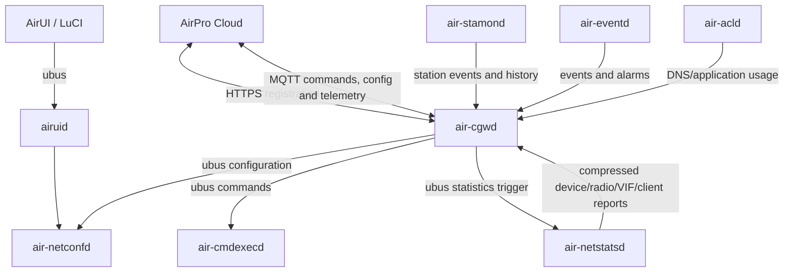
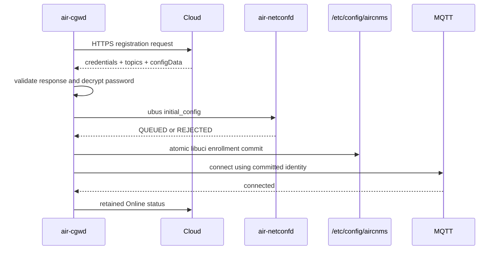

# AIROS SDK and AirCNMS Code Architecture Assessment

**Audience:** Firmware, cloud, QA, security, and release engineering
**Repository:** `/home/airpro/projects/airpro/git/airos-sdk`
**AirCNMS package:** `packages/aircnms`
**Assessment date:** 2026-09-28
**Assessment basis:** Direct review of the current source tree, build integration, manager entry points, onboarding flow, MQTT library, netconfd queue/apply path, init scripts, and existing board-validation evidence

---

## 1. Executive summary

AIROS is an OpenWrt firmware assembly repository. It combines a board-specific OpenWrt SDK, base filesystem overlays, AirUI/LuCI components, and the native AirCNMS management package into a firmware image. AirCNMS is implemented primarily in C and is split into independently supervised daemons that communicate through ubus. `air-cgwd` owns cloud registration and MQTT transport; the remaining managers own configuration, statistics, client monitoring, events, commands, policy, and local UI integration.

The current AirCNMS source is substantially stronger than its original implementation. AP onboarding now follows a validate-then-apply model, rejects malformed registration responses, verifies HTTPS, avoids logging credentials, applies initial configuration before persisting identity, and commits enrollment data through native libuci. Netconfd now queues configuration asynchronously, validates payloads before mutation, removes poison messages, batches desired-state wireless changes, checks runtime convergence, and has been exercised on a physical MT7621 AP across a broad configuration matrix.

The main gaps are now system-level rather than basic input handling:

1. MQTT transport TLS is disabled in `libmosqev`.
2. Online presence is retained while the Offline Last Will is not retained, allowing stale retained Online state.
3. Configuration acknowledgement stops at local queue admission; the cloud cannot observe final `APPLIED` or `FAILED` state.
4. The netconfd queue is volatile and has no revision, persistence, or supersession semantics.
5. MQTT command dispatch uses payload substring matching instead of exact topic and parsed message type.
6. Shell commands and unbounded legacy string operations remain throughout platform/configuration code.
7. Broker parsing accepts hostnames during registration but requires IPv4 on restart.
8. The working tree contains generated binaries and uncommitted release changes, weakening reproducibility.
9. Much of the configuration evidence is physical-board testing rather than repeatable automated regression coverage.

Onboarding is close to release-candidate quality. The complete configuration/control plane should not yet be called fail-proof until MQTT TLS, retained presence, exact routing, revisioned configuration acknowledgement, and clean reproducible builds are addressed.

---

## 2. Repository and build structure

```text
airos-sdk
├── build.sh
├── config/profiles
├── base-files
├── bsp
├── patches
├── packages
│   ├── aircnms
│   └── luci-app-airos
└── releases
```

The active paths are:

| Purpose | Path |
|---|---|
| AIROS source | `/home/airpro/projects/airpro/git/airos-sdk` |
| AirCNMS source | `/home/airpro/projects/airpro/git/airos-sdk/packages/aircnms` |
| MT7621 OpenWrt SDK | `/home/airpro/projects/airpro/mtk/mt7621/sdk/openwrt` |
| SDK AirCNMS copy | `/home/airpro/projects/airpro/mtk/mt7621/sdk/openwrt/package/feeds/aircnms` |

For a package-only build:

```sh
cd /home/airpro/projects/airpro/mtk/mt7621/sdk/openwrt
make package/aircnms/clean
make package/aircnms/compile -j4
```

The AirCNMS OpenWrt package builds shared libraries first, copies them into the SDK staging directory, then builds each manager against those libraries and the selected target platform. The package recipe currently identifies MTK, MTK Jedi, and QCA board families.

The top-level `build.sh` copies AirCNMS and the AirUI/LuCI overlay into the SDK, selects board configuration, enables the OpenSSL hostapd variant for WPA3/SAE, runs `make defconfig`, builds the firmware, and copies the sysupgrade image into `releases`.

### Build concerns

- The SDK path is hardcoded to one workstation.
- Output and profile handling are not fully parameterized.
- The IPQ branch contains MT7621-named paths and requires independent validation.
- Build outputs currently appear inside the source tree.
- A release build is not guaranteed to start from a clean Git checkout.

A production release pipeline should accept SDK/profile paths as inputs and record the source commit, `.config` hash, toolchain identity, IPK hash, image hash, and complete build log.

---

## 3. Runtime architecture



### Manager responsibilities

| Daemon | Responsibility |
|---|---|
| `air-cgwd` | Device identity, cloud registration, credential handling, MQTT connection, subscriptions, telemetry publication, cloud command routing |
| `air-netconfd` | Wireless, radio, VLAN, NAT, firewall, schedules, ACL, RADIUS, rate limits, network configuration, retained desired state |
| `air-netstatsd` | Device, radio, VIF, client, neighbor and survey statistics |
| `air-stamond` | Station association events, nl80211 monitoring, DHCP identity, DNS/SNI/client history |
| `air-eventd` | Alarm and event handling/forwarding |
| `air-cmdexecd` | Reboot, reset, firmware upgrade, RF scan and remote command execution |
| `air-acld` | Packet capture, DNS/application mapping and usage reporting |
| `airuid` | Local AirUI/LuCI ubus API and controlled calls into configuration services |

### Shared libraries

| Library | Role |
|---|---|
| `libcommon` | OS wrappers, utilities, memory helpers and network-interface helpers |
| `libds` | Lists and tree data structures |
| `liblog` | Local, remote and syslog logging |
| `libmosqev` | Mosquitto integration with libev |
| `libunixcomm` | Local process communication abstraction |
| `libdhcpfp` | DHCP fingerprinting |
| `libdatapipeline` | Statistics/report data structures and pipeline helpers |
| platform libraries | MTK/QCA radio and statistics implementation |

---

## 4. Service lifecycle

AirCNMS daemons are installed as OpenWrt `procd` services. The major managers enable respawn and emit stdout/stderr into the system log.

Typical startup order:

| Priority | Service |
|---:|---|
| 96 | `airinit` |
| 97 | cgwd, netconfd, netstatsd, stamond, eventd |
| 98 | airuid |
| 99 | cmdexecd |

Cgwd starts only when the AirCNMS UCI mode is `cloud`. Startup priorities provide ordering hints but do not prove that network, ubus dependencies, netconfd, or cloud DNS are actually ready.

### Lifecycle strengths

- Processes are independently supervised.
- A crash in one manager need not terminate every AirCNMS function.
- Cgwd handles SIGTERM and publishes local offline state during graceful shutdown.
- Managers expose clear process boundaries for configuration, telemetry and commands.

### Lifecycle risks

- Several services share priority 97 without explicit readiness dependencies.
- Cgwd can attempt initial configuration before netconfd is ready.
- There is no common manager health/status API.
- Queue state is lost when netconfd restarts.
- Restart storms are observable in logs but not centrally rate-limited or reported to the cloud.

Recommended improvements are procd service triggers, bounded dependency retries, manager health methods over ubus, and boot/session identifiers in cloud telemetry.

---

## 5. AP onboarding flow

### 5.1 Device identity

Cgwd derives the device MAC from `eth0`, removes separators, uppercases it, and persists:

```text
macaddr    = 587BE9248BEA
serial_num = AIR587BE9248BEA
```

The serial convention is therefore tied to the selected interface and MAC derivation rule. A hardware/platform change must preserve this identity contract or provide migration logic.

### 5.2 Registration request

Cgwd sends the following classes of data:

- serial number and MAC,
- firmware and hardware identity,
- management and egress IP,
- 2.4 GHz and 5 GHz radio information,
- location and timezone.

The HTTPS client uses:

- peer certificate verification,
- hostname verification,
- 10-second connect timeout,
- 45-second total timeout,
- low-speed termination,
- bounded response storage.

### 5.3 Registration response validation

The response parser requires and validates:

- `deviceId`, `orgId`, network ID and username,
- broker and numeric port,
- encrypted password and resource key,
- `configData`, `deviceTopic` and `statsTopic` objects,
- required command/configuration topics,
- required telemetry topics,
- unique subscription topics,
- maximum response and configuration sizes,
- duplicate JSON-key rejection.

The password is decrypted only after structural validation. Temporary cryptographic buffers and the temporary plaintext password are cleansed before return.

### 5.4 Validate, configure, then persist

The critical sequence is:



A failed request, invalid response, decryption error, rejected initial configuration, or failed UCI commit preserves the previous committed identity.

### Important semantic limitation

The initial netconfd response currently confirms queue admission, not completed configuration application. Cgwd treats acceptance as sufficient to persist credentials. This prevents the old 3-second ubus timeout but does not prove that initial configuration later reached `QUEUE_APPLIED`.

For a strict onboarding guarantee, initial configuration needs either synchronous completion with a longer bounded timeout or a local revision/result query before credential commit.

---

## 6. MQTT and presence behavior

Cgwd loads the broker, port, device identity, organization/network, username and password from UCI. It creates a Mosquitto/libev client, establishes subscriptions, publishes telemetry, and reconnects on failure.

### Current positive behavior

- Broker address and port originate in the cloud registration response.
- Subscription topics are replaced and deduplicated during registration.
- Reconnect attempts are automatic.
- Online publication occurs after MQTT reports connected.
- Online status uses QoS 1 and retained delivery.
- A Last Will is installed for unexpected disconnects.
- Statistics publication uses queues rather than a fixed periodic MQTT timer.
- Received cloud payloads are not logged in full.

### MQTT transport TLS gap

`libmosqev` contains TLS wrapper functions, but `mosqev_reinit_settings()` currently returns before applying TLS settings:

```c
return 0; /* TLS disabled */
```

Consequently, production MQTT on port `35930` is plaintext. The registration API is protected by HTTPS, but the credentials obtained through it are later transmitted to a non-TLS MQTT endpoint during authentication, and cloud commands/telemetry are not transport-encrypted.

This is a release-blocking security concern for untrusted or public networks.

### Retained presence inconsistency

Cgwd publishes Online using retained QoS 1, while its Offline Last Will is configured as non-retained. After an unexpected disconnect:

1. Current consumers may receive Offline.
2. The broker can retain the earlier Online value.
3. A later/restarted consumer may receive stale Online.

The minimum correction is a retained Offline Last Will. The more robust design adds `boot_id`, session/connection generation, timestamps and cloud precedence rules so older status cannot override a newer session.

### Broker hostname inconsistency

Registration accepts a general validated broker string, including DNS names. Restart loading reparses the saved broker as dotted IPv4. A DNS broker that works immediately after enrollment may fail after reboot.

The persisted broker should be copied as a validated hostname/IP string without forcing IPv4 parsing.

---

## 7. Cloud message routing

Cgwd subscribes to authorized topics and forwards messages over ubus. The current dispatcher inspects the payload for the substring `cmd`, then checks for `rf_scan`; otherwise it sends the payload to netconfd.

This is weaker than topic-based routing because an unrelated JSON field or value containing `cmd` can change the destination.

Recommended dispatch order:

1. Match the received topic against the exact authorized topic table.
2. Parse the JSON object with duplicate-key rejection.
3. Validate a versioned message type/schema.
4. Route to the corresponding manager.
5. Reject unknown topic/type combinations.

No routing decision should depend on an unstructured substring search.

---

## 8. Netconfd configuration plane

### 8.1 Queue admission

The ubus handler validates:

- presence of `data` and `size`,
- exact equality of declared and actual payload size,
- non-zero size,
- maximum queue size.

It allocates an owned copy, places it into the queue, and returns:

```json
{
  "accepted": true,
  "status": "QUEUED",
  "message": "configuration queued",
  "queueDepth": 1
}
```

A rejected message receives `REJECTED` and an error message.

### 8.2 Queue behavior

The queue is bounded to:

- 200 items,
- 2 MiB total payload storage.

When required to make room, the queue drops items from the head. A timer processes the queue once per second. Each item is removed after one attempt. Failed/unsupported payloads are logged as `QUEUE_DROP`; successful operations are logged as `QUEUE_APPLIED`.

### Queue limitations

- Queue data is not persisted.
- Sequence numbers reset after daemon restart.
- Head eviction is not revision-aware.
- Multiple full desired-state records are not coalesced.
- Cloud cannot query a queued item by ID.
- `QUEUE_APPLIED` is only a local log event.
- There is no automatic retry distinction between transient apply failure and permanently invalid input.

A revisioned desired-state journal should supersede older unapplied full configurations, persist the newest accepted revision, and retain apply result/failure reason.

### 8.3 Validation and application

Netconfd validates the complete payload before mutation. The current hardening covers:

- radio mode/channel/country/txpower,
- SSID length and hidden mode,
- encryption and key lengths,
- WPA2, WPA2/WPA3 transition and WPA3 Personal,
- RADIUS fields,
- schedules,
- VLAN IDs,
- NAT addresses and masks,
- ACL identities,
- rate limits,
- duplicate and malformed structures.

Wireless VIF changes are committed as one desired-state batch followed by one `wifi reload`. Runtime convergence checks require expected interfaces to appear or disappear.

### WPA3 support

The build selects `hostapd-openssl`, which supplies SAE/OWE support:

| Mode | UCI mapping | PMF |
|---|---|---|
| WPA3 Personal | `sae` | required (`ieee80211w=2`) |
| WPA2/WPA3 transition | `sae-mixed` | optional (`ieee80211w=1`) |
| Open | no key | stale PMF/key removed |

WPA3 Personal and transition mode were verified on the MT7621 board. WPA3 Enterprise remains accepted by the schema but lacks complete client/RADIUS association testing and should remain canary-only.

---

## 9. Shell execution and memory-safety debt

Netconfd still makes extensive use of:

- `system()`
- `popen()`
- constructed UCI commands
- constructed hostapd commands
- constructed `tc` commands
- `sprintf()`
- `strcpy()`
- `strcat()`

The strict validator reduces the likelihood of cloud-originated command injection, but safety depends on every input path continuing to use that validator. Local AirUI/ubus paths and future fields could bypass assumptions.

### Recommended migration order

1. Replace shell UCI commands with native libuci.
2. Replace interface/firewall inspection with ubus/netlink APIs where practical.
3. Replace `system()` with fixed executable/argument invocation when no native API exists.
4. Replace unbounded string calls with checked helpers.
5. Add compile-time hardening and sanitizers to host-testable modules.
6. Fuzz JSON/config parsers and message dispatch.

This work can be incremental; the highest priority is code that interpolates externally supplied SSID, interface, network, RADIUS, ACL or schedule fields.

---

## 10. Credential handling

### Cloud response

The broker password arrives encrypted and is decrypted using the resource key. Registration response bodies and decrypted credentials are not logged, and temporary cryptographic material is cleansed.

### Local persistence

Cgwd stores the decrypted MQTT password in UCI so it can reconnect after reboot without registering again. This is operationally necessary with the current credential model but means security depends on local filesystem access controls.

Release verification must include:

```sh
stat -c '%a %U:%G' /etc/config/aircnms
```

The file should be readable only by root. Diagnostic bundles must redact the password and topic credentials.

Longer-term improvements include encrypted local storage tied to a device secret, device certificates, or hardware-backed identity where supported.

---

## 11. Statistics and client visibility

Netstatsd collects device, client, VIF and neighbor data, serializes/compresses it, and sends it to cgwd for MQTT publication. Stamond supplements this with station events, DHCP identity, DNS/SNI and client history.

Positive protections include:

- compressed-buffer bounds checks,
- record count validation,
- integer-overflow checks,
- size checks before copying,
- cleanup of nested client allocations on failure.

Remaining concerns:

- Several reports rely on large fixed-size buffers.
- Queue overflow/loss behavior needs metrics.
- Versioning of internal binary report structures is not explicit.
- A mismatch between daemons built from different source revisions can break raw struct serialization.

Internal messages should carry a protocol version and field-length framing rather than relying indefinitely on matching C structure layouts.

---

## 12. Source and release hygiene

At assessment time, the AIROS working tree contained modified source files and untracked generated artifacts, including compiled managers, object files, shared libraries, a package tarball, release output and a swap file.

This creates several risks:

- stale binaries can be mistaken for current build results,
- package copies can diverge from the source repository,
- a release cannot be reproduced solely from the recorded commit,
- unrelated changes can enter a package or firmware image.

### Required hygiene

- Add generated binaries, objects, libraries, archives, SDK copies and release output to `.gitignore` where appropriate.
- Remove generated files from source directories before release.
- Build from a clean pinned checkout or immutable bundle.
- Copy source into the SDK in one controlled direction.
- Verify the SDK copy against the source tree before compiling.
- Store release artifacts outside the source tree.
- Record SHA-256 for the AirCNMS IPK, manager binaries and firmware image.

---

## 13. Test coverage assessment

### Existing evidence

Current documented/implemented coverage includes:

- host-side credential decryption tests,
- warnings-as-errors package compilation,
- fresh and replay registration,
- credential hash stability,
- topic deduplication,
- initial configuration acceptance,
- restart without re-registration,
- malformed registration/configuration rejection,
- retained configuration replay,
- WPA2/WPA3 Personal and transition configurations,
- eight-VIF desired-state batches,
- radio, ACL, rate-limit failure, VLAN and NAT tests,
- daemon restart and configuration rollback.

### Missing or under-automated areas

1. Registration JSON parser fuzzing.
2. MQTT topic/type routing tests.
3. MQTT TLS and CA-expiry tests.
4. Retained Online/Offline behavior across consumer restart.
5. Broker hostname behavior across AP reboot.
6. Netconfd queue overflow and supersession behavior.
7. Power loss during UCI commit or wireless reload.
8. Netconfd crash after queue acceptance.
9. Configuration revision replay and stale-message rejection.
10. AirUI ubus malformed input tests.
11. Positive rate-limit tests with an associated station.
12. WPA3 Enterprise client/RADIUS matrix.
13. Long-running memory/FD leak tests.
14. Multi-AP scale and broker/cloud outage tests.
15. Firmware rollback and compatibility testing between daemon versions.

---

## 14. Risk register

| Priority | Risk | Impact | Recommended action |
|---|---|---|---|
| P0 | MQTT TLS disabled | Credential and control-plane exposure | Enable verified MQTT TLS and test certificate lifecycle |
| P0 | Retained Online with non-retained Offline will | Stale online status after unexpected disconnect | Retain Offline will and add session precedence |
| P0 | Payload-substring command routing | Message can be misrouted | Route by exact topic and validated type |
| P1 | No cloud-visible config result | Operator cannot know applied state | Add revision/hash and `APPLIED`/`FAILED` acknowledgement |
| P1 | Volatile queue | Accepted configuration can be lost on restart | Persist desired revision and last result |
| P1 | Shell/string legacy debt | Injection and memory-corruption risk | Incrementally replace with native/bounded APIs |
| P1 | Hostname accepted but IPv4 required after reboot | DNS broker breaks after restart | Store/load validated broker string unchanged |
| P1 | Dirty/non-reproducible build tree | Release/source mismatch | Clean immutable release build pipeline |
| P2 | Plaintext local MQTT password | Root/filesystem compromise exposes broker credential | Enforce root-only mode; plan stronger device identity |
| P2 | Implicit daemon startup dependencies | Boot race and partial function | Add procd triggers/readiness and bounded retries |
| P2 | Raw internal C struct transport | Version mismatch between daemons | Add protocol versions and explicit serialization |
| P2 | Mostly manual configuration tests | Regression risk | Automate captured-payload and board smoke suites |

---

## 15. Recommended release gates

### Gate 1: Source integrity

- Clean working tree or documented patch series.
- No generated objects/binaries in source directories.
- Pinned source commit and OpenWrt configuration.
- Reproducible package build from a clean checkout.

### Gate 2: Static and host verification

- Warnings-as-errors build.
- Parser/unit tests passing.
- Static analysis on changed C files.
- Sanitizer tests for host-buildable parsers and libraries.
- No new unsafe string or shell interpolation without explicit justification.

### Gate 3: Package verification

- Clean package rebuild.
- IPK and manager hashes recorded.
- Dependency and installed-file manifest captured.
- `/etc/config/aircnms` permissions verified.

### Gate 4: Single-board canary

- Serial console available.
- Configuration backup captured.
- Upgrade and daemon health verified.
- Registration replay uses same identity.
- Public MQTT endpoint connects.
- Retained desired configuration applies.
- Both radios and management connectivity remain available.
- Reboot restores all daemons without re-registration.

### Gate 5: Failure matrix

- DNS unavailable.
- Broker unavailable.
- Cloud registration unavailable.
- Netconfd unavailable during registration.
- Invalid and oversized cloud responses.
- Invalid retained configuration.
- AP restart during queued configuration.
- Broker disconnect and Last Will correctness.
- Credential rejection/recovery.

### Gate 6: Fleet canary

- Small, explicitly selected device set.
- Metrics for registration, MQTT connect, configuration outcome, crashes and queue drops.
- Rollback package and configuration restore procedure validated.
- Expansion only after a defined stability interval.

---

## 16. Prioritized engineering roadmap

### Phase A: Transport and presence correctness

1. Enable MQTT TLS with certificate/hostname verification.
2. Add CA provisioning and rotation procedure.
3. Make Offline Last Will retained.
4. Add `boot_id`, session generation and timestamp precedence.
5. Test power loss, WAN loss and broker restart.

### Phase B: Deterministic command routing

1. Replace payload substring routing with exact topic mapping.
2. Add versioned JSON message schemas.
3. Reject unknown topic/type combinations.
4. Add parser and dispatch unit/fuzz tests.

### Phase C: Configuration revisions and acknowledgement

1. Cloud assigns monotonically increasing desired revision.
2. Payload contains revision and canonical config hash.
3. AP persists the latest accepted revision before apply.
4. Netconfd records `QUEUED`, `APPLYING`, `APPLIED` or `FAILED`.
5. AP publishes final result with revision, hash, boot ID and failure code.
6. Cloud ignores stale acknowledgements and retries missing results with backoff.
7. A newer full desired state supersedes an older unapplied revision.

### Phase D: Native configuration APIs

1. Move UCI writes from shell to libuci.
2. Move runtime state checks to ubus/netlink APIs.
3. Replace unsafe string calls.
4. Add rollback boundaries for multi-file network changes.

### Phase E: Reproducible release engineering

1. Parameterize `build.sh`.
2. Build from clean immutable source.
3. Separate artifacts from the repository.
4. Produce release manifest and SBOM.
5. Automate package tests, board smoke tests and upgrade/rollback verification.

---

## 17. Current maturity conclusion

| Area | Assessment |
|---|---|
| HTTPS cloud registration | Strong |
| Registration response validation | Strong |
| Credential replay behavior | Strong |
| Initial configuration ordering | Improved; queue admission is not completion |
| Netconfd schema validation | Strong |
| Wireless desired-state application | Good |
| WPA3 Personal | Board verified |
| WPA3 Enterprise | Canary-only pending full validation |
| MQTT reconnection | Functional |
| MQTT transport security | Weak; TLS disabled |
| Presence correctness | Needs retained Offline/session handling |
| Cloud configuration acknowledgement | Missing |
| Queue durability | Missing |
| Native configuration APIs | Incomplete |
| Automated regression coverage | Moderate |
| Build reproducibility | Needs improvement |
| Source-tree hygiene | Needs immediate cleanup |

The onboarding implementation and configuration validator are credible foundations for a production AP agent. The next work should focus on transport security and distributed-state correctness rather than adding more configuration features. MQTT TLS, presence precedence, exact message routing, revisioned configuration outcomes, and reproducible releases will produce the largest reliability and security improvement.

---

## 18. Related documents

- `docs/ONBOARDING_HARDENING.md`
- `docs/ONBOARDING_RC1_RELEASE.md`
- `docs/NETCONFD_CONFIGURATION_HARDENING.md`
- `ARCHITECTURE_DESIGN.md`
- `ARCHITECTURE_OVERVIEW.md`
- `IDENTITY_IMPLEMENTATION_SPEC.md`
- `JOURNAL_IMPLEMENTATION_SPEC.md`
